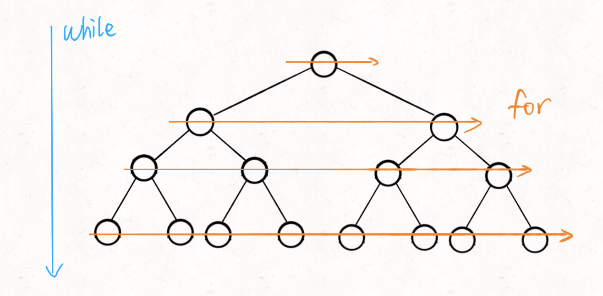

# BFS

BFS 的核心思想应该不难理解的，就是把一些问题抽象成图，从一个点开始，向四周开始扩散。一般来说，我们写 BFS 算法都是用「队列」这种数据结构，每次将一个节点周围的所有节点加入队列。

BFS 相对 DFS 的最主要的区别是：BFS 找到的路径一定是最短的，但代价就是空间复杂度可能比 DFS 大很多，至于为什么，我们后面介绍了框架就很容易看出来了。

## 算法框架

要说框架的话，我们先举例一下 BFS 出现的常见场景好吧，问题的本质就是让你**在一幅「图」中找到从起点 start 到终点 target 的最近距离**，这个例子听起来很枯燥，但是 BFS 算法问题其实都是在干这个事儿。

## 代码框架

```c++
// 计算从起点 start 到终点 target 的最近距离
int BFS(Node start, Node target) {
    Queue<Node> q; // 核心数据结构
    Set<Node> visited; // 避免走回头路
    
    q.offer(start); // 将起点加入队列
    visited.add(start);
    int step = 0; // 记录扩散的步数

    while (q not empty) {
        int sz = q.size();
        /* 将当前队列中的所有节点向四周扩散 */
        for (int i = 0; i < sz; i++) {
            Node cur = q.poll();
            /* 划重点：这里判断是否到达终点 */
            if (cur is target)
                return step;
            /* 将 cur 的相邻节点加入队列 */
            for (Node x : cur.adj()) {
                if (x not in visited) {
                    q.offer(x);
                    visited.add(x);
                }
            }
        }
        /* 划重点：更新步数在这里 */
        step++;
    }
}
```

队列 q 就不说了，BFS 的核心数据结构；cur.adj() 泛指 cur 相邻的节点，比如说二维数组中，cur 上下左右四面的位置就是相邻节点；visited 的主要作用是防止走回头路，大部分时候都是必须的，但是像一般的二叉树结构，没有子节点到父节点的指针，不会走回头路就不需要 visited。

这里注意这个 while 循环和 for 循环的配合，while 循环控制一层一层往下走，for 循环利用 sz 变量控制从左到右遍历每一层二叉树节点：

