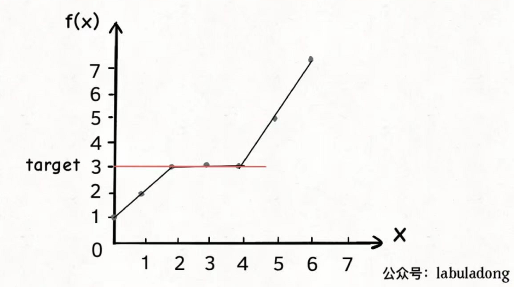
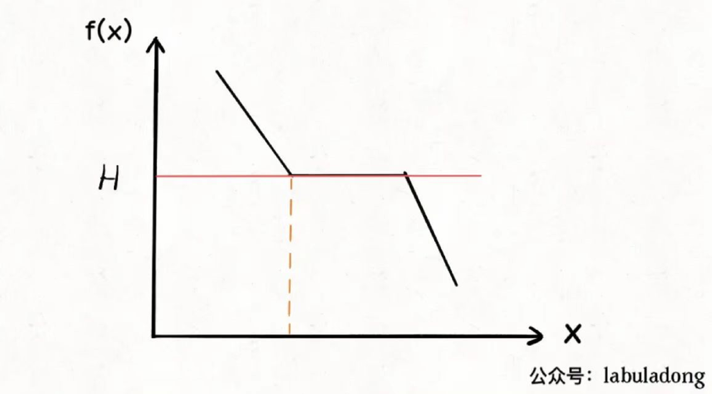

# 爱吃香蕉的珂珂

珂珂喜欢吃香蕉。这里有 n 堆香蕉，第 i 堆中有piles[i]根香蕉。警卫已经离开了，将在 h 小时后回来。

珂珂可以决定她吃香蕉的速度 k （单位：根/小时）。每个小时，她将会选择一堆香蕉，从中吃掉 k 根。如果这堆香蕉少于 k 根，她将吃掉这堆的所有香蕉，然后这一小时内不会再吃更多的香蕉。

珂珂喜欢慢慢吃，但仍然想在警卫回来前吃掉所有的香蕉。

返回她可以在 h 小时内吃掉所有香蕉的最小速度 k（k 为整数）。

## 题目描述精简

珂珂每小时最多只能吃一堆香蕉。如果吃不完的话，留到下一个小时再吃。如果吃完了，还有胃口，也只会等到下一个小时，才会吃下一堆。

他想在警卫回来之前吃完所有的香蕉，让我们确定吃香蕉的最小速度 k。

## 二分搜索问题的泛化

什么问题可以运用二分搜索算法技巧？

首先，你要从题目中抽象出一个自变量 x，一个关于 x 的函数 f(x)，以及一个目标值target。

同时，x, f(x), target 还要满足以下条件：

1. f(x)必须是在 x 上的单调函数（单调增，单调减都可以）。
2. 题目是让你计算满足约束条件 f(x) == target 时的 x 的值。

上述规则听起来有点抽象，来举个具体的例子：

给你一个升序排列的有序数组 nums 以及一个目标元素 target, 请你计算 target 在数组中的索引位置，如果有多个目标元素，返回最小的索引。

这就是 搜索左侧边界 这个基本题型。解法代码之前都写了，但这里面 x，f(x), target 分别是什么呢？

我们可以把数组中元素的索引认为是自变量 x, 函数关系 f(x) 就可以这样设定：

```
func f(nums []int, x int){
    return nums[x]
}
```

其实这个函数 f 就是在访问数组 nums，因为 nums 是升序排列的，所以函数 f(x) 就是在 x 上单调递增的函数。

最后，题目让我们求什么来着？是不是让我们计算元素 target 的最左侧索引？

是不是就相当于在问我们：满足 f(x) == target 的 x 的最小值是多少？

画个图，如下：



如果遇到一个算法问题，能够把它抽象成这幅图，就可以对它运用二分搜索算法。

算法代码如下：

```
func leftBound(nums []int, target int) int {
	n := len(nums)
	// 左闭右开区间 [left, right)
	left := 0
	right := n
	// 循环条件为什么是 left < right，不是 left <= right？
	// 因为退出条件是 left == right, 此时搜索区间 [left, left) 为空，所以可以正确终止。
	for left < right {
		// 防止整数溢出
		mid := left + (right-left)/2
		if target > f(mid, nums) {
			// 在 [mid+1, right) 区间继续搜索
			left = mid + 1
		} else if target < f(mid, nums) {
			// 在 [left, mid) 区间继续搜索
			right = mid
		} else if target == f(mid, nums) {
			// 不要立即返回，而是缩小「搜索区间」的上界 right，
			// 在区间 [left, mid) 中继续搜索，即不断向左收缩，达到锁定左侧边界的目的。
			right = mid
		}
	}
	return left
}
```

这段代码把之前的代码微调了一下，把直接访问 nums[mid] 套了一层函数 f，其实就是多此一举。但是，这样能抽象出二分搜索思想在具体算法问题中的框架。

## 运用二分搜索的套路框架

想要用二分搜索解决具体的算法问题，可以从以下代码框架着手思考：

```
// 函数 f 是关于自变量 x 的单调函数
func f(x){
    // ...
}

// 主函数，在 f(x) == target 的约束下求 x 的最值
func solution(nums []int, target int) int {
	if len(nums) == 0{
		return -1
	}
	// 问自己，自变量x的最小值是多少？
	left:=...
	// 问自己，自变量x的最大值是多少？
	right:=... + 1
	for left < right{
		mid:=left + (right - left)/2
		if f(mid) == target{
			// 问自己，题目是求左边界还是右边界？
		}else if f(mid) < target{
			// 问自己，怎么让 f(x) 大一点？
		}else if f(mid) > target{
			// 问自己，怎么让 f(x) 小一点？
		}
	}
	return left
}
```

具体来说，想要用二分搜索解决问题，分为以下几步：

1. 确定 x, f(x), target 分别是什么，并写出函数 f 的代码。
2. 找到 x 的取值范围作为二分搜索的搜索区间，初始化 left 和 right 变量。
3. 根据题目的要求，确定应该使用搜索左侧还是搜索右侧的二分搜索算法，写出解法代码

下面以 爱吃香蕉的珂珂 为例，来讲一下这个流程。

## 解法

1. 确定 x, f(x), target 分别是什么，并写出函数 f 的代码。

自变量 x 是什么呢？回忆之前的函数图像，二分搜索的本质就是在搜索自变量。

所以，题目让求什么，就把什么设为自变量，珂珂吃香蕉的速度就是自变量 x 。

那么，在 x 上单调的函数关系 f(x) 是什么？

显然，吃香蕉的速度越快，吃完所有香蕉堆所需的时间就越少。速度和时间就是一个单调函数关系。

所以，f(x) 函数就可以这样定义：

若吃香蕉的速度为 x 根 / 小时, 则需要 f(x) 小时吃完所有香蕉。

f(x) 代码实现如下：

```
// x；speed. 吃香蕉的速度
// f(x): 吃完所有香蕉的用时
// f(x) 是 x 的单调递减函数
// target 也很明显。在用时小于等于 h 的限制条件下，求 x 的最小值。所以 target 就是 h。
func f(piles []int, speed int) int {
	hours := 0
	for i := 0; i < len(piles); i++ {
		hours += piles[i] / speed
		if piles[i]%speed > 0 {
			hours++
		}
	}
	return hours
}
```

target 就很明显了，吃香蕉的时间限制 h 自然就是 target, 是对 f(x) 返回值的最大约束。

2. 找到 x 的取值范围作为二分搜索的搜索区间，初始化 left 和 right。

珂珂吃香蕉的速度最小是多少？最大是多少？

显然，最小速度应该是1，最大速度是 piles 数组中元素的最大值，因为每小时最多吃一堆香蕉，胃口再大也白搭。

这里可以有2种选择，要么你用一个 for 循环，遍历piles数组，计算最大值。要么你看题目给的约束，piles 中的元素取值范围是多少，然后给right初始化一个取值范围之外的值。

我选择第二种。题目说了 1 <= piles[i] <= 10^9，那么我就可以确定二分搜索的区间边界：

```
func minEatingSpeed(piles []int, h int) int {
	// 二分搜索区间：[left, right)
	left := 1
	// 这里不能这么写：10^9，因为在go语言中，^表示异或符号
	right := 1000000000 + 1
}
```

3. 根据题目的要求，确定应该使用搜索左侧还是搜索右侧的二分搜索算法，写出解法代码。

现在我们确定了自变量x是吃香蕉的速度，f(x)是单调递减的函数，target就是吃香蕉的时间限制 h，题目要我们计算最小速度，也就是x要尽可能小:



这就是搜索左侧边界的二分搜索嘛，不过注意 f(x) 是单调递减的，不要闭眼睛套框架，需要结合上图进行思考，写出代码：

```
// 二分法
// 第一步：确定x, f(x), target。并写出f(x)的代码
// 第二步，找到x的取值范围，作为二分搜索的搜索区间。初始化 left 和 right 变量
func minEatingSpeed(piles []int, h int) int {
	// 二分搜索区间：[left, right)
	left := 1
	// 这里不能这么写：10^9，因为在go语言中，^表示异或符号
	right := 1000000000 + 1
	for left < right {
		mid := left + (right-left)/2
		if f(piles, mid) == h {
			// 求吃完所有香蕉的最小速度，因此是求左边界
			right = mid
		} else if f(piles, mid) < h {
			right = mid
		} else if f(piles, mid) > h {
			left = mid + 1
		}
	}
	return left
}

// x；speed. 吃香蕉的速度
// f(x): 吃完所有香蕉的用时
// f(x) 是 x 的单调递减函数
// target 也很明显。在用时小于等于 h 的限制条件下，求 x 的最小值。所以 target 就是 h。
func f(piles []int, speed int) int {
	hours := 0
	for i := 0; i < len(piles); i++ {
		hours += piles[i] / speed
		if piles[i]%speed > 0 {
			hours++
		}
	}
	return hours
}
```