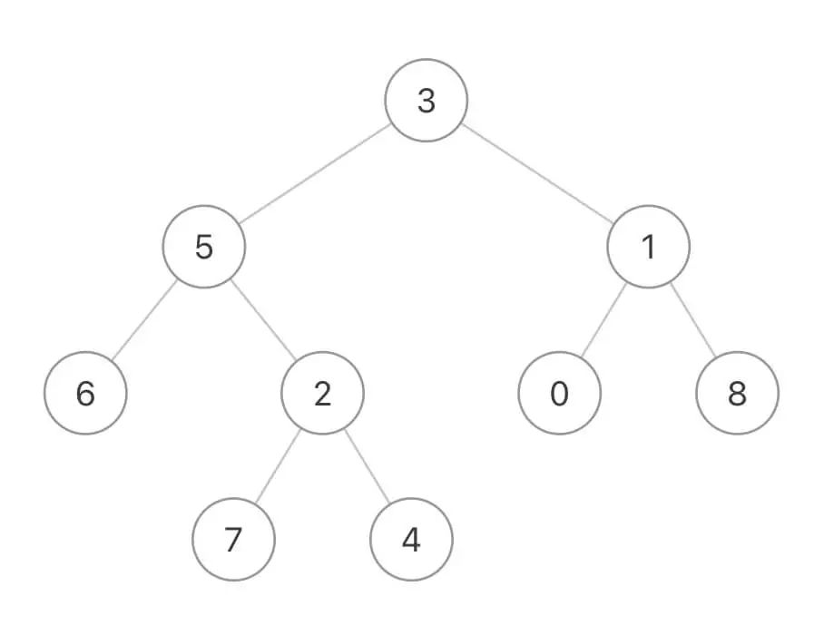
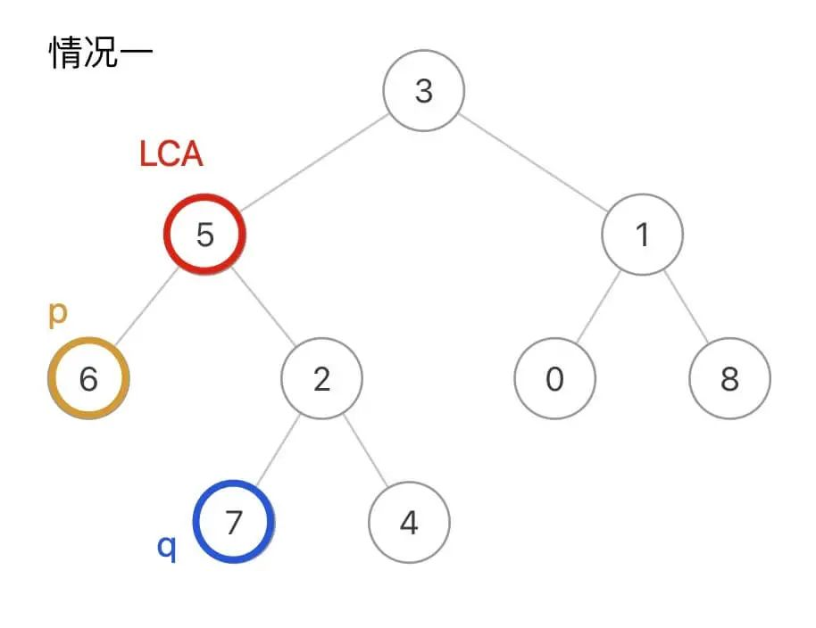

# 二叉树的最近公共祖先

[https://mp.weixin.qq.com/s/njl6nuid0aalZdH5tuDpqQ](https://mp.weixin.qq.com/s/njl6nuid0aalZdH5tuDpqQ)

给你输入一棵不含重复值的二叉树，以及存在于树中的两个节点p和q，请你计算p和q的最近公共祖先节点。

PS：后文我用LCA（Lowest Common Ancestor）作为最近公共祖先节点的缩写。

## 解题步骤

1. 先写一个标准的在树中寻找val1或者val2节点的函数。
2. 只需在后序位置添加一个判断逻辑：如果一个节点能够在它的左右子树中分别找到p和q，则该节点为LCA节点。

## 寻找一个元素

先不管最近公共祖先问题，我请你实现一个简单的算法：

给你输入一棵没有重复元素的二叉树根节点root和一个目标值val，请你写一个函数寻找树中值为val的节点。

这个函数应该很容易实现对吧，比如我这样写代码：

```
// 定义：在以 root 为根的二叉树中寻找值为 val 的节点
TreeNode find(TreeNode root, int val) {
    // base case
    if (root == null) {
        return null;
    }
    // 看看 root.val 是不是要找的
    if (root.val == val) {
        return root;
    }
    // root 不是目标节点，那就去左子树找
    TreeNode left = find(root.left, val);
    if (left != null) {
        return left;
    }
    // 左子树找不着，那就去右子树找
    TreeNode right = find(root.right, val);
    if (right != null) {
        return right;
    }
    // 实在找不到了
    return null;
}
```

我再改一下题目，现在不让你找值为val的节点，而是寻找值为val1或val2的节点。这和我们第一次实现的find函数基本上是一样的：

```
// 定义：在以 root 为根的二叉树中寻找值为 val1 或 val2 的节点
TreeNode find(TreeNode root, int val1, int val2) {
    // base case
    if (root == null) {
        return null;
    }
    // 前序位置，看看 root 是不是目标值
    if (root.val == val1 || root.val == val2) {
        return root;
    }
    // 去左右子树寻找
    TreeNode left = find(root.left, val1, val2);
    TreeNode right = find(root.right, val1, val2);
    // 后序位置，已经知道左右子树是否存在目标值

    return left != null ? left : right;
}
```

为什么要写这样一个奇怪的find函数呢？因为最近公共祖先系列问题的解法都是把这个函数作为框架的。

比如输入这样一棵二叉树：



如果p是节点6，q是节点7，那么它俩的LCA就是节点5：


当然，p和q本身也可能是LCA，比如这种情况q本身就是LCA节点：


那么对于任意一个节点，它怎么才能知道自己是不是p和q的最近公共祖先？

如果一个节点能够在它的左右子树中分别找到p和q，则该节点为LCA节点。

**这就要用到之前实现的find函数了，只需在后序位置添加一个判断逻辑，即可改造成寻找最近公共祖先的解法代码：**

```
TreeNode lowestCommonAncestor(TreeNode root, TreeNode p, TreeNode q) {
    return find(root, p.val, q.val);
}

// 在二叉树中寻找 val1 和 val2 的最近公共祖先节点
TreeNode find(TreeNode root, int val1, int val2) {
    if (root == null) {
        return null;
    }
    // 前序位置
    if (root.val == val1 || root.val == val2) {
        // 如果遇到目标值，直接返回
        return root;
    }
    TreeNode left = find(root.left, val1, val2);
    TreeNode right = find(root.right, val1, val2);
    // 后序位置，已经知道左右子树是否存在目标值
    if (left != null && right != null) {
        // 当前节点是 LCA 节点
        return root;
    }

    return left != null ? left : right;
}
```

在find函数的后序位置，如果发现left和right都非空，就说明当前节点是LCA节点，即解决了第一种情况：



在find函数的前序位置，如果找到一个值为val1或val2的节点则直接返回，恰好解决了第二种情况：


因为题目说了p和q一定存在于二叉树中(这点很重要），所以即便我们遇到q就直接返回，根本没遍历到p，也依然可以断定p在q底下，q就是LCA节点。