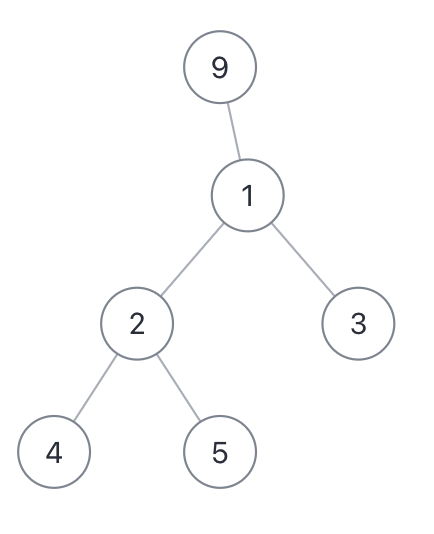

# 二叉树的直径

力扣第 543 题「二叉树的直径」，让你计算一棵二叉树的最长直径长度。

所谓二叉树的「直径」长度，就是任意两个结点之间的路径长度。最长「直径」并不一定要穿过根结点，比如下面这棵二叉树：

它的最长直径是 3，即 [4,2,1,3] 或者 [5,2,1,3] 这两条「直径」的长度。

解决这题的关键在于，**每一条二叉树的「直径」长度，就是一个节点的左右子树的最大深度之和。**

我们应该把计算「直径」的逻辑放在后序位置，准确说应该是放在 maxDepth 的后序位置，因为 maxDepth 的后序位置是知道左右子树的最大深度的。

讲到这里，照应一下前文：遇到子树问题，首先想到的是给函数设置返回值，然后在后序位置做文章。
