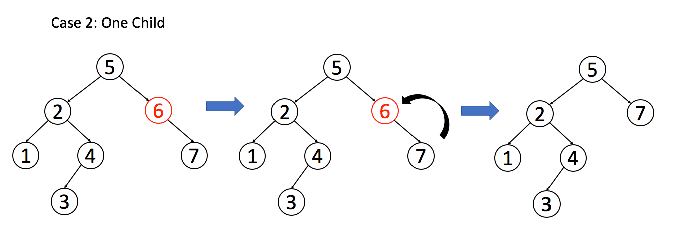

# 删除二叉搜索树中的节点

[https://leetcode-cn.com/problems/delete-node-in-a-bst/](https://leetcode-cn.com/problems/delete-node-in-a-bst/)

这个问题稍微复杂，跟插入操作类似，先「找」再「改」，先把框架写出来再说：

```
TreeNode deleteNode(TreeNode root, int key) {
    if (root.val == key) {
        // 找到啦，进行删除
    } else if (root.val > key) {
        // 去左子树找
        root.left = deleteNode(root.left, key);
    } else if (root.val < key) {
        // 去右子树找
        root.right = deleteNode(root.right, key);
    }
    return root;
}
```

找到目标节点了，比方说是节点 A，如何删除这个节点，这是难点。因为删除节点的同时不能破坏 BST 的性质。有三种情况，用图片来说明。

情况 1：A 恰好是末端节点，两个子节点都为空，那么它可以当场去世了。


```
if (root.left == null && root.right == null)
    return null;
```

情况 2：A 只有一个非空子节点，那么它要让这个孩子接替自己的位置。



```
// 排除了情况 1 之后
if (root.left == null) return root.right;
if (root.right == null) return root.left;
```

情况 3：A 有两个子节点，麻烦了，为了不破坏 BST 的性质，A 必须找到左子树中最大的那个节点，或者右子树中最小的那个节点来接替自己。我们以第二种方式讲解。


```
// 处理情况 3
// 获得右子树最小的节点
TreeNode minNode = getMin(root.right);
// 删除右子树最小的节点
root.right = deleteNode(root.right, minNode.val);
// 用右子树最小的节点替换 root 节点
minNode.left = root.left;
minNode.right = root.right;
root = minNode;
```

三种情况分析完毕，填入框架，简化一下代码：

```
TreeNode deleteNode(TreeNode root, int key) {
    if (root == null) return null;
    if (root.val == key) {
        // 这两个 if 把情况 1 和 2 都正确处理了
        if (root.left == null) return root.right;
        if (root.right == null) return root.left;
        // 处理情况 3
        // 获得右子树最小的节点
        TreeNode minNode = getMin(root.right);
        // 删除右子树最小的节点
        root.right = deleteNode(root.right, minNode.val);
        // 用右子树最小的节点替换 root 节点
        minNode.left = root.left;
        minNode.right = root.right;
        root = minNode;
    } else if (root.val > key) {
        root.left = deleteNode(root.left, key);
    } else if (root.val < key) {
        root.right = deleteNode(root.right, key);
    }
    return root;
}

TreeNode getMin(TreeNode node) {
    // BST 最左边的就是最小的
    while (node.left != null) node = node.left;
    return node;
}
```

## 总结

在二叉树递归框架之上，扩展出一套 BST 代码框架：

```
void BST(TreeNode root, int target) {
    if (root.val == target)
        // 找到目标，做点什么
    if (root.val < target) 
        BST(root.right, target);
    if (root.val > target)
        BST(root.left, target);
}
```