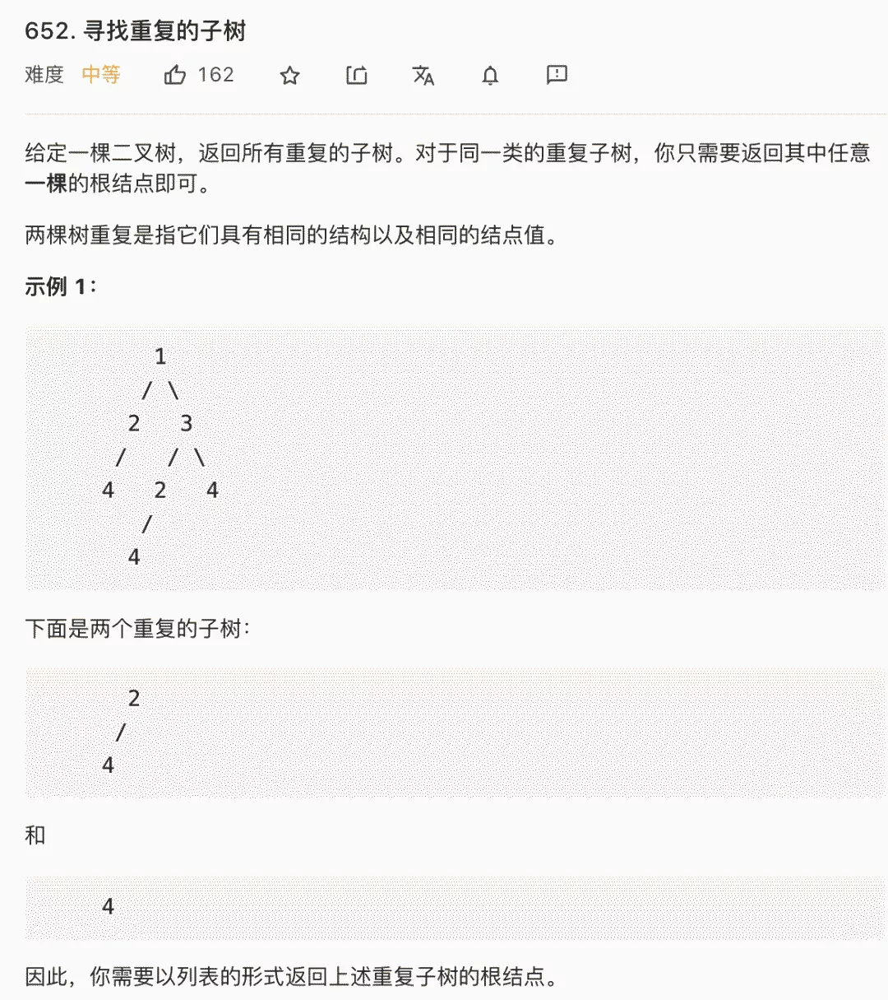
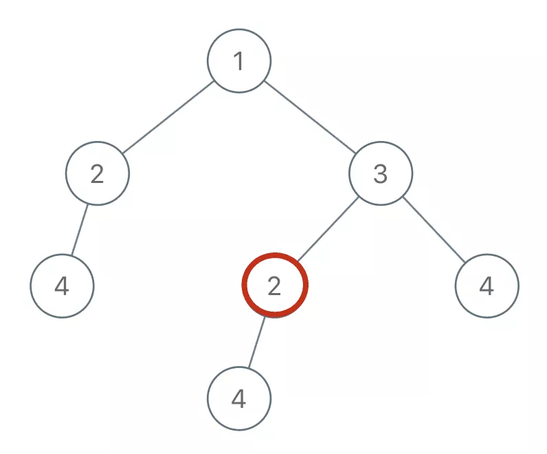

# 寻找重复子树



我来简单解释下题目，输入是一棵二叉树的根节点root，返回的是一个列表，里面装着若干个二叉树节点，这些节点对应的子树在原二叉树中是存在重复的。

这题咋做呢？还是老套路，先思考，对于某一个节点，它应该做什么。

比如说，你站在图中这个节点 2 上：



如果你想知道以自己为根的子树是不是重复的，是否应该被加入结果列表中，你需要知道什么信息？

你需要知道以下两点：

1、以我为根的这棵二叉树（子树）长啥样？

2、以其他节点为根的子树都长啥样？

这就叫知己知彼嘛，我得知道自己长啥样，还得知道别人长啥样，然后才能知道有没有人跟我重复，对不对？

好，那我们一个一个来解决，先来思考，我如何才能知道以自己为根的二叉树长啥样？

其实看到这个问题，就可以判断本题要使用「后序遍历」框架来解决。

为什么？很简单呀，我要知道以自己为根的子树长啥样，是不是得先知道我的左右子树长啥样，再加上自己，就构成了整棵子树的样子？

现在，明确了要用后序遍历，那应该怎么描述一棵二叉树的模样呢？我们前文 序列化和反序列化二叉树 其实写过了，二叉树的前序/中序/后序遍历结果可以描述二叉树的结构。

所以，我们可以通过拼接字符串的方式把二叉树序列化，看下代码：

```c++
String traverse(TreeNode root) {
    // 对于空节点，可以用一个特殊字符表示
    if (root == null) {
        return "#";
    }
    // 将左右子树序列化成字符串
    String left = traverse(root.left);
    String right = traverse(root.right);
    /* 后序遍历代码位置 */
    // 左右子树加上自己，就是以自己为根的二叉树序列化结果
    String subTree = left + "," + right + "," + root.val;
    return subTree;
}
```

我们用非数字的特殊符#表示空指针，并且用字符,分隔每个二叉树节点值，这属于序列化二叉树的套路了，不多说。

注意我们subTree是按照左子树、右子树、根节点这样的顺序拼接字符串，也就是后序遍历顺序。你完全可以按照前序或者中序的顺序拼接字符串，因为这里只是为了描述一棵二叉树的样子，什么顺序不重要。

这样，我们第一个问题就解决了，对于每个节点，递归函数中的subTree变量就可以描述以该节点为根的二叉树。

现在我们解决第二个问题，我知道了自己长啥样，怎么知道别人长啥样？这样我才能知道有没有其他子树跟我重复对吧。

这很简单呀，我们借助一个外部数据结构，让每个节点把自己子树的序列化结果存进去，这样，对于每个节点，不就可以知道有没有其他节点的子树和自己重复了么？

初步思路可以使用HashSet记录子树，但是呢，这有个问题，如果出现多棵重复的子树，结果集res中必然出现重复，而题目要求不希望出现重复。

为了解决这个问题，可以把HashSet升级成HashMap，额外记录每棵子树的出现次数：

```c++
// 记录所有子树以及出现的次数
HashMap<String, Integer> memo = new HashMap<>();
// 记录重复的子树根节点
LinkedList<TreeNode> res = new LinkedList<>();

/* 主函数 */
List<TreeNode> findDuplicateSubtrees(TreeNode root) {
    traverse(root);
    return res;
}

/* 辅助函数 */
String traverse(TreeNode root) {
    if (root == null) {
        return "#";
    }

    String left = traverse(root.left);
    String right = traverse(root.right);

    String subTree = left + "," + right+ "," + root.val;

    int freq = memo.getOrDefault(subTree, 0);
    // 多次重复也只会被加入结果集一次
    if (freq == 1) {
        res.add(root);
    }
    // 给子树对应的出现次数加一
    memo.put(subTree, freq + 1);
    return subTree;
}
```

## 注意避坑

在golang中，整数转字符串，不能用string()这种方式，它的结果是错误的。必须用strconv.Itoa方法。否则，提交会报解答错误。


