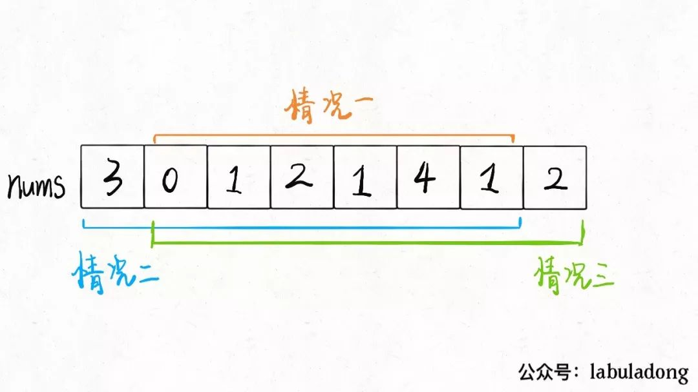

# 打家劫舍II

这道题目和第一道描述基本一样，强盗依然不能抢劫相邻的房子，输入依然是一个数组，但是告诉你这些房子不是一排，而是围成了一个圈。

也就是说，现在第一间房子和最后一间房子也相当于是相邻的，不能同时抢。

首先，首尾房间不能同时被抢，那么只可能有三种不同情况：要么都不被抢；要么第一间房子被抢最后一间不抢；要么最后一间房子被抢第一间不抢。

那就简单了啊，这三种情况，哪种的结果最大，就是最终答案呗！不过，其实我们不需要比较三种情况，只要比较情况二和情况三就行了，因为这两种情况对于房子的选择余地比情况一大呀，房子里的钱数都是非负数，所以选择余地大，最优决策结果肯定不会小。

假设数组 nums 的长度为 n。如果不偷窃最后一间房屋，则偷窃房屋的下标范围是 [0, n-2]；如果不偷窃第一间房屋，则偷窃房屋的下标范围是 [1, n-1]。在确定偷窃房屋的下标范围之后，即可用第 198 题的方法解决。
