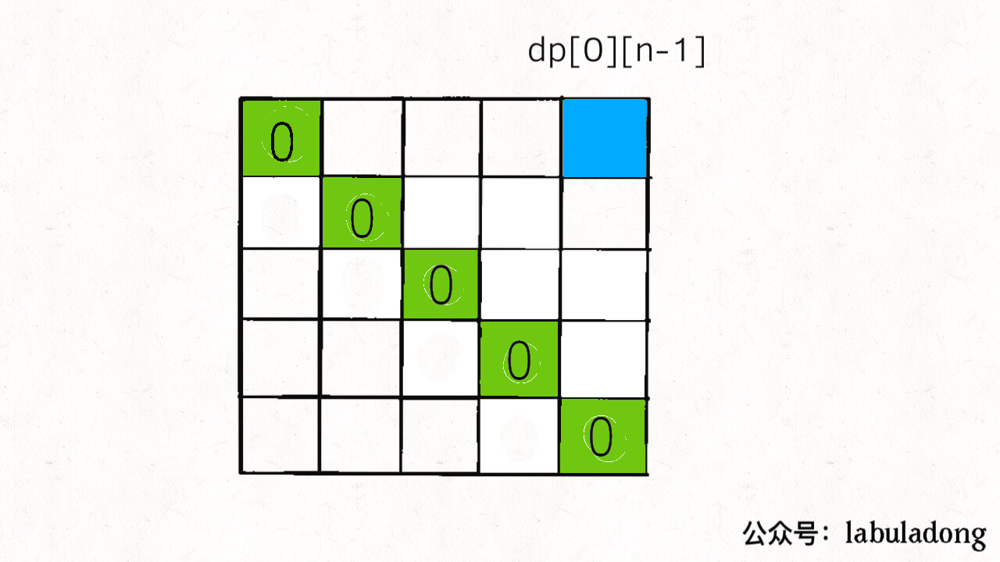
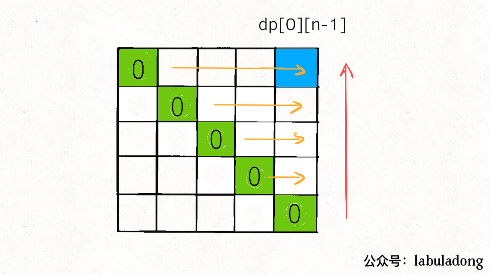

# 构造回文的最小插入次数

1312 题。

输入一个字符串 s，你可以在字符串的任意位置插入任意字符。如果要把 s 变成回文串，请你计算最少要进行多少次插入？

## 思路

首先，要找最少的插入次数，那肯定得穷举喽，如果我们用暴力算法穷举出所有插入方法，时间复杂度是多少？

每次都可以在两个字符的中间插入任意一个字符，外加判断字符串是否为回文字符串，这时间复杂度肯定爆炸，是指数级。

那么无疑，这个问题需要使用动态规划技巧来解决。之前的文章说过，回文问题一般都是从字符串的中间向两端扩散，构造回文串也是类似的。

我们定义一个二维的 dp 数组，dp[i][j] 的定义如下：对字符串 s[i..j]，最少需要进行 dp[i][j] 次插入才能变成回文串。

我们想求整个 s 的最少插入次数，根据这个定义，也就是想求 dp[0][n-1] 的大小（n 为 s 的长度）。

同时，base case 也很容易想到，当 i == j 时 dp[i][j] = 0，因为当 i == j 时 s[i..j] 就是一个字符，本身就是回文串，所以不需要进行任何插入操作。

接下来就是动态规划的重头戏了，利用数学归纳法思考状态转移方程。

## 状态转移方程

如果我们现在想计算 dp[i][j] 的值，而且假设我们已经计算出了子问题 dp[i+1][j-1] 的值了，你能不能想办法推出 dp[i][j] 的值呢？

既然已经算出 dp[i+1][j-1]，即知道了 s[i+1..j-1] 成为回文串的最小插入次数，那么也就可以认为 s[i+1..j-1] 已经是一个回文串了，所以通过 dp[i+1][j-1] 推导 dp[i][j] 的关键就在于 s[i] 和 s[j] 这两个字符。

这个得分情况讨论，如果 s[i] == s[j] 的话，我们不需要进行任何插入，只要知道如何把 s[i+1..j-1] 变成回文串即可。

如果 s[i] != s[j] 的话，就比较麻烦了。

步骤一，做选择，先将 s[i..j-1] 或者 s[i+1..j] 变成回文串。怎么做选择呢？谁变成回文串的插入次数少，就选谁呗。

那我怎么知道 s[i+1..j] 和 s[i..j-1] 谁变成回文串的代价更小呢？

回头看看 dp 数组的定义是什么，dp[i+1][j] 和 dp[i][j-1] 不就是它们变成回文串的代价么？

步骤二，根据步骤一的选择，将 s[i..j] 变成回文。

如果你在步骤一中选择把 s[i+1..j] 变成回文串，那么在 s[i+1..j] 右边插入一个字符 s[i] 一定可以将 s[i..j] 变成回文；同理，如果在步骤一中选择把 s[i..j-1] 变成回文串，在 s[i..j-1] 左边插入一个字符 s[j] 一定可以将 s[i..j] 变成回文。

那么根据刚才对 dp 数组的定义以及以上的分析，s[i] != s[j] 时的代码逻辑如下：

```
if (s[i] != s[j]) {
    // 步骤一选择代价较小的
    // 步骤二必然要进行一次插入
    dp[i][j] = min(dp[i + 1][j], dp[i][j - 1]) + 1;
}
```

综合起来，状态转移方程如下：

```
if (s[i] == s[j]) {
    dp[i][j] = dp[i + 1][j - 1];
} else {
    dp[i][j] = min(dp[i + 1][j], dp[i][j - 1]) + 1;
}
```

## 代码实现

首先想想 base case 是什么，当 i == j 时 dp[i][j] = 0，因为这时候 s[i..j] 就是单个字符，本身就是回文串，不需要任何插入；最终的答案是 dp[0][n-1]（n 是字符串 s 的长度）。那么 dp table 长这样：



又因为状态转移方程中 dp[i][j] 和 dp[i+1][j]，dp[i]-1]，dp[i+1][j-1] 三个状态有关，为了保证每次计算 dp[i][j] 时，这三个状态都已经被计算，我们一般选择从下向上，从左到右遍历 dp 数组：



```
int minInsertions(string s) {
    int n = s.size();
    // 定义：对 s[i..j]，最少需要插入 dp[i][j] 次才能变成回文
    vector<vector<int>> dp(n, vector<int>(n, 0));
    // base case：i == j 时 dp[i][j] = 0，单个字符本身就是回文
    // dp 数组已经全部初始化为 0，base case 已初始化

    // 从下向上遍历
    for (int i = n - 2; i >= 0; i--) {
        // 从左向右遍历
        for (int j = i + 1; j < n; j++) {
            // 根据 s[i] 和 s[j] 进行状态转移
            if (s[i] == s[j]) {
                dp[i][j] = dp[i + 1][j - 1];
            } else {
                dp[i][j] = min(dp[i + 1][j], dp[i][j - 1]) + 1;
            }
        }
    }
    // 根据 dp 数组的定义，题目要求的答案
    return dp[0][n - 1];
}
```