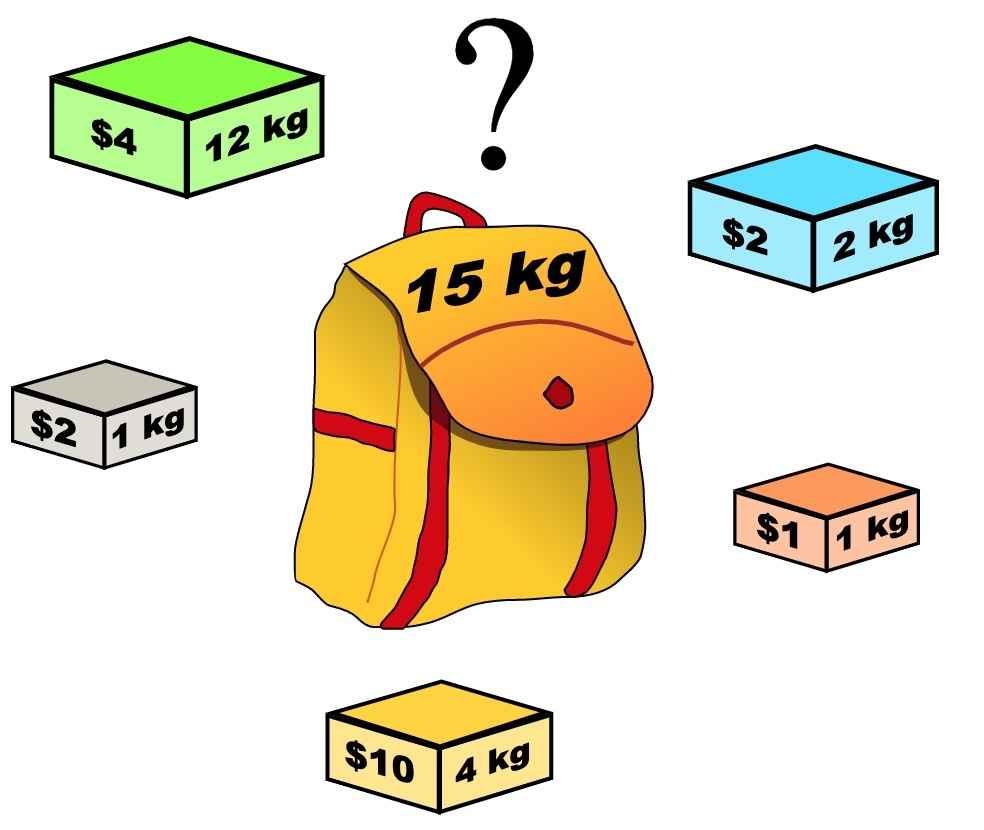

# 0-1背包问题

给你一个可装载重量为 W 的背包和 N 个物品，每个物品有重量和价值两个属性。其中第 i 个物品的重量为 wt[i]，价值为 val[i]，现在让你用这个背包装物品，最多能装的价值是多少？



题目就是这么简单，一个典型的动态规划问题。这个题目中的物品不可以分割，要么装进包里，要么不装，不能说切成两块装一半。这就是 0-1 背包这个名词的来历。

## 动规标准套路

**第一步要明确两点，「状态」和「选择」。**

先说状态，如何才能描述一个问题局面？只要给几个物品，和一个背包的容量限制，就形成了一个背包问题呀。所以状态有两个，就是「背包的容量」和「可选择的物品」。可选择的物品就是下表 i 来表示的。

再说选择，也很容易想到啊，对于每件物品，你能选择什么？选择就是「装进背包」或者「不装进背包」嘛。

明白了状态和选择，动态规划问题基本上就解决了，只要往这个框架套就完事儿了：

```
for 状态1 in 状态1的所有取值：
    for 状态2 in 状态2的所有取值：
        for ...
            dp[状态1][状态2][...] = 择优(选择1，选择2...)
```

求选择1，选择2...的时候，主要思路是看最后一步。

**第二步要明确 dp 数组的定义。**

首先看看刚才找到的「状态」，有两个，也就是说我们需要一个二维 dp 数组。

dp[i][w] 的定义如下：对于前 i 个物品，当前背包的剩余容量为 w，这种情况下可以装的最大价值是 dp[i][w]。

比如说，如果 dp[3][5] = 6，其含义为：对于给定的一系列物品中，若只对前 3 个物品进行选择，当背包容量为 5 时，最多可以装下的价值为 6。

PS：为什么要这么定义？便于状态转移，或者说这就是套路，记下来就行了。建议看一下我们的动态规划系列文章，几种套路都被扒得清清楚楚了。

根据这个定义，我们想求的最终答案就是 dp[N][W]。base case 就是 dp[0][..] = dp[..][0] = 0，因为没有物品或者背包没有空间的时候，能装的最大价值就是 0。

细化上面的框架：

```
int[][] dp[N+1][W+1]
dp[0][..] = 0
dp[..][0] = 0

for i in [1..N]:
    for w in [1..W]:
        dp[i][w] = max(
            把物品 i 装进背包,
            不把物品 i 装进背包
        )
return dp[N][W]
```

第三步，根据「选择」，思考状态转移的逻辑。考虑最后一步。

简单说就是，上面伪码中「把物品 i 装进背包」和「不把物品 i 装进背包」怎么用代码体现出来呢？

这就要结合对 dp 数组的定义，看看这两种选择会对状态产生什么影响：

先重申一下刚才我们的 dp 数组的定义：

dp[i][w] 表示：对于前 i 个物品，当前背包的容量为 w 时，这种情况下可以装下的最大价值是 dp[i][w]。

如果你没有把这第 i 个物品装入背包，那么很显然，最大价值 dp[i][w] 应该等于 dp[i-1][w]，继承之前的结果。

如果你把这第 i 个物品装入了背包，那么 dp[i][w] 应该等于 dp[i-1][w - wt[i-1]] + val[i-1]。

首先，由于 i 是从 1 开始的，所以 val 和 wt 的索引是 i-1 时表示第 i 个物品的价值和重量。

而 dp[i-1][w - wt[i-1]] 也很好理解：你如果装了第 i 个物品，就要寻求剩余重量 w - wt[i-1] 限制下的最大价值，加上第 i 个物品的价值 val[i-1]。

综上就是两种选择，我们都已经分析完毕，也就是写出来了状态转移方程，可以进一步细化代码：

```
for i in [1..N]:
    for w in [1..W]:
        dp[i][w] = max(
            dp[i-1][w],
            dp[i-1][w - wt[i-1]] + val[i-1]
        )
return dp[N][W]
```

最后一步，把伪码翻译成代码，处理一些边界情况：需要处理 w - wt[i-1] 可能小于 0 导致数组索引越界的问题。

```
int knapsack(int W, int N, int[] wt, int[] val) {
    // base case 已初始化
    int[][] dp = new int[N + 1][W + 1];
    for (int i = 1; i <= N; i++) {
        for (int w = 1; w <= W; w++) {
            if (w - wt[i - 1] < 0) {
                // 这种情况下只能选择不装入背包
                dp[i][w] = dp[i - 1][w];
            } else {
                // 装入或者不装入背包，择优
                dp[i][w] = Math.max(
                    dp[i - 1][w - wt[i-1]] + val[i-1], 
                    dp[i - 1][w]
                );
            }
        }
    }
    
    return dp[N][W];
}
```