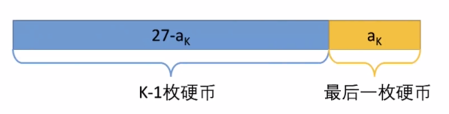
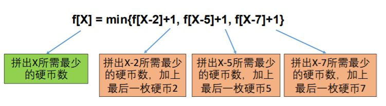

# 零钱兑换

322。

4步解题法：
- 确定问题状态（研究最优策略的最后一步，转化为子问题）。
- 转移方程（根据子问题定义直接得到）。
- 初始条件和边界情况（细心，考虑周全）。
- 计算顺序（利用之前的计算结果）。

## 举例子

你有三种硬币，分别面值2元，5元和7元，每种硬币都有足够多。买一本书需要27元。如何用最少的硬币组合正好付清，不需要对方找钱？

### 第一步，确定问题状态

状态在动态规划中的作用属于定海神针。解动态规划时需要开一个数组，这里的“状态”就是指数组的每个元素 dp[i] 或 dp[i][j] 代表什么。

确定状态需要两个意识：最后一步和子问题。

1. 最后一步

这道题中，我们不知道最优策略是什么，但最优策略肯定是K枚硬币a1,a2……aK面值加起来是27。这里的“最后一步”就是存在最后一枚硬币aK。除去aK，前面的硬币面值和为27-aK。

这里有两个关键点：

- 我们不关心前面的K-1枚硬币是怎么拼出27-aK的，我们也不知道aK和K，但是我们确定前面的硬币拼出了27-aK。
- 因为是最优策略，所以拼出的27-ak硬币数一定要最少，否则就不是最优策略。

2. 子问题

现在问题变成了：最少用多少枚硬币可以拼出27-aK。也就是将原问题（27）转化成了一个子问题，而且规模更小（27-aK）。

这种与原问题内核一致，但是规模更小的问题，就叫子问题。

为了简化定义，我们设状态f(X)=最少用多少枚硬币拼出X。所以问题就从求f(X)变成求f(X-aK)我们目前还不知道最后的硬币aK面额多少，但它的面额一定只可能是2/5/7之一。如果aK是2，f(27)应该是f(27-2) + 1 (加上最后这一枚面值2的硬币）如果aK是5，f(27)应该是f(27-5) + 1 (加上最后这一枚面值5的硬币）如果aK是7，f(27)应该是f(27-7) + 1 (加上最后这一枚面值7的硬币）除此以外，没有其他的可能了。因为要求最少的硬币数，所以问题的解就可以这样表示：f(27) = min{f(27-2)+1, f(27-5)+1, f(27-7)+1}

我们目前还不知道最后的硬币aK面额多少，但它的面额一定只可能是2/5/7之一。

- 如果aK是2，f(27)应该是f(27-2) + 1 (加上最后这一枚面值2的硬币）
- 如果aK是5，f(27)应该是f(27-5) + 1 (加上最后这一枚面值5的硬币）
- 如果aK是7，f(27)应该是f(27-7) + 1 (加上最后这一枚面值7的硬币）

除此以外，没有其他的可能了。

因为要求最少的硬币数，所以问题的解就可以这样表示：

f(27) = min{f(27-2)+1, f(27-5)+1, f(27-7)+1}

### 第二步，转移方程

设状态f[X]=最少用多少枚硬币拼出X

对于任意X，f[X] = min{f[X-2]+1, f[X-5]+1, f[X-7]+1}

实际面试中，如果正确列出转移方程，问题基本就解决一半了。

很多同学基本也可以做到写出状态转移方程，但真正写程序的时候往往会出现很多错误或问题。

这就涉及到在写代码前的两个重要步骤，就是我们4步解题法的第三步和第四步。

### 第三步：初始条件和边界情况

f[X] = min{f[X-2]+1, f[X-5]+1, f[X-7]+1}的边界情况是X-2, X-5或者X-7不能小于0（硬币面值为正）。

故对边界情况设定如下：

如果硬币面值不能组合出Y，就定义f[Y]=正无穷

例如f[-1]=f[-2]=…=正无穷；

f[1] =min{f[-1]+1, f[-4]+1,f[-6]+1}=正无穷,表示拼不出1

特殊情况：本题的F[0]对应的情况为F[-2]、F[-5]、F[-7]，按照上文的边界情况设定结果是正无穷。

但是实际上F[0]的结果是存在的（即使用0个硬币的情况下），F[0]=0。

这种用转移方程无法计算，但是又实际存在的情况，就必须通过手动定义。

所以这里定义初始条件为：F[0]=0。

而从0之后的数值是没矛盾的，比如F[1]= F[1-2]+1= F[-1]+1=正无穷（正无穷加任何数结果还是正无穷）；F[2]= F[2-2]+1= F[0]+1=1……

### 确定计算顺序

那么开始计算时，是从F[1]、F[2]开始？还是从F[27]、F[26]开始呢？

判断计算顺序正确与否的原则是：

当我们要计算F[X]（等式左边，如F[10]）的时候，等式右边（f[X-2], f[X-5], f[X-7]等）都是已经得到结果的状态，这个计算顺序就是OK的。

