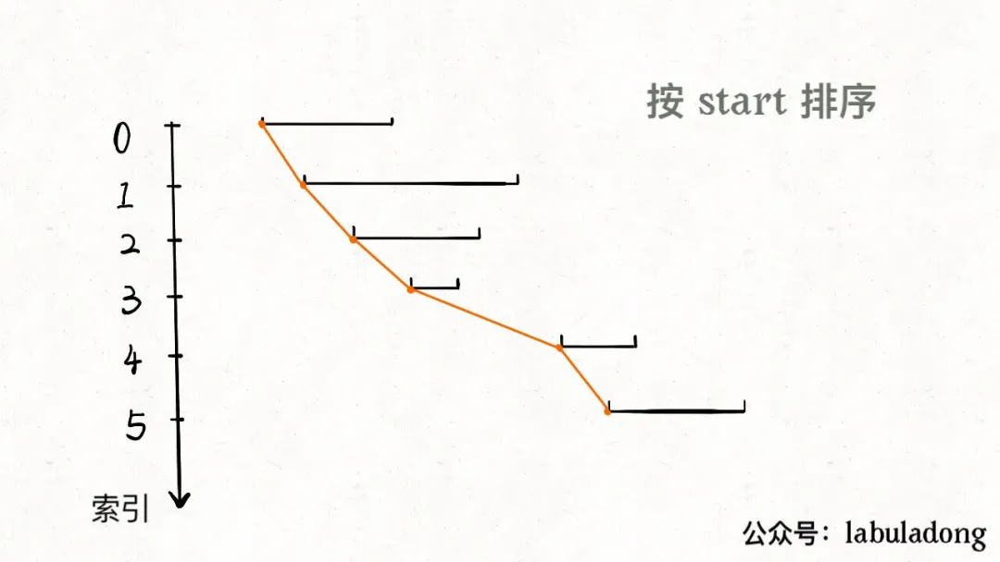

# 删除被覆盖区域

这是力扣第 1288 题，看下题目：

给你一个区间列表，请你删除列表中被其他区间所覆盖的区间。

只有当 c <= a 且 b <= d 时，我们才认为区间 [a,b) 被区间 [c,d) 覆盖。

在完成所有删除操作后，请你返回列表中剩余区间的数目。

示例：

> 输入：intervals = [[1,4],[3,6],[2,8]]
> 
> 输出：2
> 
> 解释：区间 [3,6] 被区间 [2,8] 覆盖，所以它被删除了。

题目问我们，去除被覆盖区间之后，还剩下多少区间，那么我们可以先算一算，被覆盖区间有多少个，然后和总数相减就是剩余区间数。

对于这种区间问题，如果没啥头绪，首先排个序看看，比如我们按照区间的起点进行升序排序：



排序之后，两个相邻区间可能有如下三种相对位置：


对于这三种情况，我们应该这样处理：

对于情况一，找到了覆盖区间。

对于情况二，两个区间可以合并，成一个大区间。

对于情况三，两个区间完全不相交。

依据几种情况，我们可以写出如下代码：

```
int removeCoveredIntervals(int[][] intvs) {
    // 按照起点升序排列，起点相同时降序排列
    Arrays.sort(intvs, (a, b) -> {
        if (a[0] == b[0]) {
            return b[1] - a[1];
        }
        return a[0] - b[0]; 
    });

    // 记录合并区间的起点和终点
    int left = intvs[0][0];
    int right = intvs[0][1];

    int res = 0;
    for (int i = 1; i < intvs.length; i++) {
        int[] intv = intvs[i];
        // 情况一，找到覆盖区间
        if (left <= intv[0] && right >= intv[1]) {
            res++;
        }
        // 情况二，找到相交区间，合并
        if (right >= intv[0] && right <= intv[1]) {
            right = intv[1];
        }
        // 情况三，完全不相交，更新起点和终点
        if (right < intv[0]) {
            left = intv[0];
            right = intv[1];
        }
    }

    return intvs.length - res;
}
```

以上就是本题的解法代码，起点升序排列，终点降序排列的目的是防止如下情况：


对于这两个起点相同的区间，我们需要保证长的那个区间在上面（按照终点降序），这样才会被判定为覆盖，否则会被错误地判定为相交，少算一个覆盖区间。

