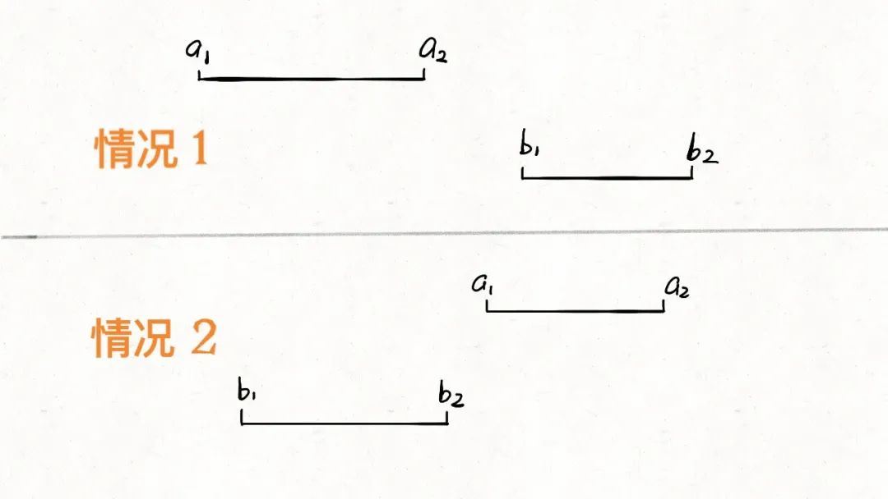
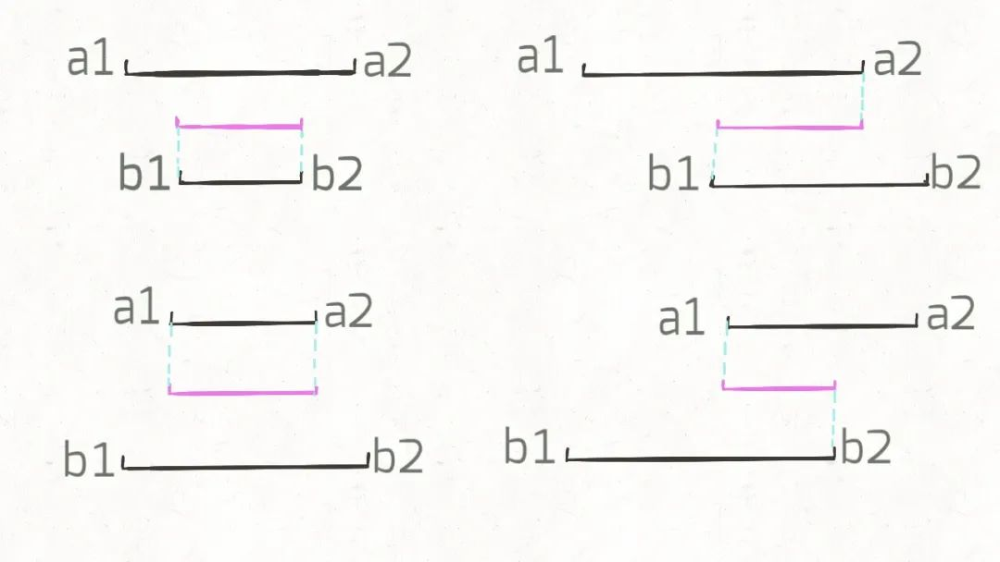
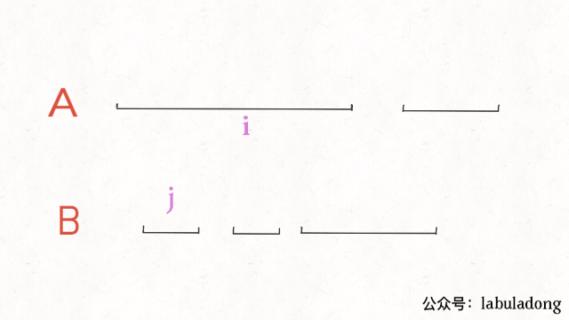

# 区间交集问题

先看下题目，力扣第 986 题就是这个问题：

给定两个由一些 闭区间 组成的列表，firstList 和 secondList ，其中 firstList[i] = [start_i, end_i] 而secondList[j] = [start_j, end_j] 。每个区间列表都是成对 不相交 的，并且 已经排序 。

返回这 两个区间列表的交集 。


题目很好理解，就是让你找交集，注意区间都是闭区间。

解决区间问题的思路一般是先排序，以便操作，不过题目说已经排好序了，那么可以用两个索引指针在A和B中游走，把交集找出来，代码大概是这样的：

```
# A, B 形如 [[0,2],[5,10]...]
def intervalIntersection(A, B):
    i, j = 0, 0
    res = []
    while i < len(A) and j < len(B):
        # ...
        j += 1
        i += 1
    return res
```

不难，我们先老老实实分析一下各种情况。

首先，对于两个区间，我们用[a1,a2]和[b1,b2]表示在A和B中的两个区间，那么什么情况下这两个区间没有交集呢：



只有这两种情况，写成代码的条件判断就是这样：

```
if b2 < a1 or a2 < b1:
    [a1,a2] 和 [b1,b2] 无交集
```

那么，什么情况下，两个区间存在交集呢？根据命题的否定，上面逻辑的否命题就是存在交集的条件：

```
# 不等号取反，or 也要变成 and
if b2 >= a1 and a2 >= b1:
    [a1,a2] 和 [b1,b2] 存在交集
```

接下来，两个区间存在交集的情况有哪些呢？穷举出来：


这很简单吧，就这四种情况而已。那么接下来思考，这几种情况下，交集是否有什么共同点呢？



我们惊奇地发现，交集区间是有规律的！如果交集区间是[c1,c2]，那么c1=max(a1,b1)，c2=min(a2,b2)！这一点就是寻找交集的核心，我们把代码更进一步：

```
while i < len(A) and j < len(B):
    a1, a2 = A[i][0], A[i][1]
    b1, b2 = B[j][0], B[j][1]
    if b2 >= a1 and a2 >= b1:
        res.append([max(a1, b1), min(a2, b2)])
    # ...
```

最后一步，我们的指针i和j肯定要前进（递增）的，什么时候应该前进呢？



结合动画示例就很好理解了，是否前进，只取决于a2和b2的大小关系：

```
while i < len(A) and j < len(B):
    # ...
    if b2 < a2:
        j += 1
    else:
        i += 1
```

以此思路写出代码：

```
# A, B 形如 [[0,2],[5,10]...]
def intervalIntersection(A, B):
    i, j = 0, 0 # 双指针
    res = []
    while i < len(A) and j < len(B):
        a1, a2 = A[i][0], A[i][1]
        b1, b2 = B[j][0], B[j][1]
        # 两个区间存在交集
        if b2 >= a1 and a2 >= b1:
            # 计算出交集，加入 res
            res.append([max(a1, b1), min(a2, b2)])
        # 指针前进
        if b2 < a2: j += 1
        else:       i += 1
    return res
```

总结一下，区间类问题看起来都比较复杂，情况很多难以处理，但实际上通过观察各种不同情况之间的共性可以发现规律，用简洁的代码就能处理。