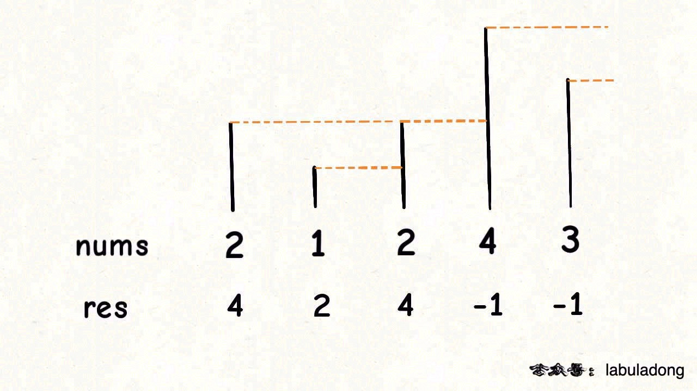

# 下一个更大元素

单调栈。单调栈实际上就是栈，只是利用了一些巧妙的逻辑，使得每次新元素入栈后，栈内的元素都保持有序（单调递增或单调递减）。

单调栈用途不太广泛，只处理一种典型的问题，叫做 Next Greater Element。

## 单调栈模板

现在给你出这么一道题：

给你一个数组 nums，请你返回一个等长的结果数组，结果数组中对应下标的位置，存放着数组中对应元素的右边的第一个比它更大的值。如果没有更大的元素，就存 -1。

比如说，输入一个数组 nums = [2,1,2,4,3]，你返回数组 [4,2,4,-1,-1]。

解释：第一个 2 后面比 2 大的数是 4; 1 后面比 1 大的数是 2；第二个 2 后面比 2 大的数是 4; 4 后面没有比 4 大的数，填 -1；3 后面没有比 3 大的数，填 -1。

这道题的暴力解法很好想到，就是对每个元素后面都进行扫描，找到第一个更大的元素就行了。但是暴力解法的时间复杂度是 O(n^2)。

这个问题可以这样抽象思考：把数组的元素想象成并列站立的人，元素大小想象成人的身高。这些人面对你站成一列，如何求元素「2」的 Next Greater Number 呢？

很简单，如果能够看到元素「2」，那么他后面可见的第一个人就是「2」的 Next Greater Number，因为比「2」小的元素身高不够，都被「2」挡住了，第一个露出来的就是答案。



```
func nextGreater(nums []int) []int {
	n := len(nums)
	// 注意，这里res长度要初始化为 n
	// 因为下面赋值是给 res[i]，而不是 res = append(res, ...), 因为是倒序的
	res := make([]int, n)
	s := make([]int, 0)
	// 倒着往栈里放
	for i := n - 1; i >= 0; i-- {
		// 判定个子高矮
		num := nums[i]
		for len(s) != 0 && s[len(s)-1] <= num {
			// 矮个起开，反正也被挡着了。。。
			s = s[:len(s)-1]
		}
		// nums[i] 身后的 next great number
		if len(s) == 0 {
			res[i] = -1
		} else {
			res[i] = s[len(s)-1]
		}
		s = append(s, num)
	}
	return res
}
```

这就是单调队列解决问题的模板。for 循环要从后往前扫描元素，因为我们借助的是栈的结构，倒着入栈，其实是正着出栈。while 循环是把两个「个子高」元素之间的元素排除，因为他们的存在没有意义，前面挡着个「更高」的元素，所以他们不可能被作为后续进来的元素的 Next Great Number 了。

这个算法的时间复杂度不是那么直观，如果你看到 for 循环嵌套 while 循环，可能认为这个算法的复杂度也是 O(n^2)，但是实际上这个算法的复杂度只有 O(n)。

分析它的时间复杂度，要从整体来看：总共有 n 个元素，每个元素都被 push 入栈了一次，而最多会被 pop 一次，没有任何冗余操作。所以总的计算规模是和元素规模 n 成正比的，也就是 O(n) 的复杂度。

## 本题解法

单调栈肯定是要写的，除此之外，本题还需要先在nums2中找到nums1中的每个元素。可以提前遍历nums2, 用 map 保存元素值 -> 下标的映射。