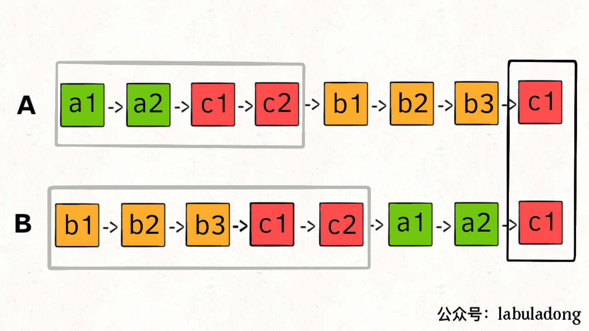

# 2个链表是否相交

这个问题有意思，也是力扣第 160 题「相交链表」函数签名如下：

```c++
ListNode getIntersectionNode(ListNode headA, ListNode headB);
```

给你输入两个链表的头结点 headA 和 headB，这两个链表可能存在相交。

如果相交，你的算法应该返回相交的那个节点；如果没相交，则返回 null。

比如题目给我们举的例子，如果输入的两个链表如下图：


那么我们的算法应该返回 c1 这个节点。

这个题直接的想法可能是用 HashSet 记录一个链表的所有节点，然后和另一条链表对比，但这就需要额外的空间。

如果不用额外的空间，只使用两个指针，你如何做呢？

难点在于，由于两条链表的长度可能不同，两条链表之间的节点无法对应：


如果用两个指针 p1 和 p2 分别在两条链表上前进，并不能同时走到公共节点，也就无法得到相交节点 c1。

**解决这个问题的关键是，通过某些方式，让 p1 和 p2 能够同时到达相交节点 c1。**

所以，我们可以让 p1 遍历完链表 A 之后开始遍历链表 B，让 p2 遍历完链表 B 之后开始遍历链表 A，这样相当于「逻辑上」两条链表接在了一起。

如果这样进行拼接，就可以让 p1 和 p2 同时进入公共部分，也就是同时到达相交节点 c1：



那你可能会问，如果说两个链表没有相交点，是否能够正确的返回 null 呢？

这个逻辑可以覆盖这种情况的，相当于 c1 节点是 null 空指针嘛，可以正确返回 null。

这样，这道题就解决了，空间复杂度为 O(1)，时间复杂度为 O(N)。