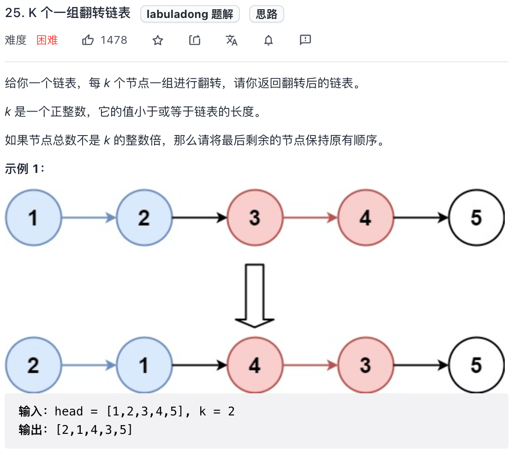
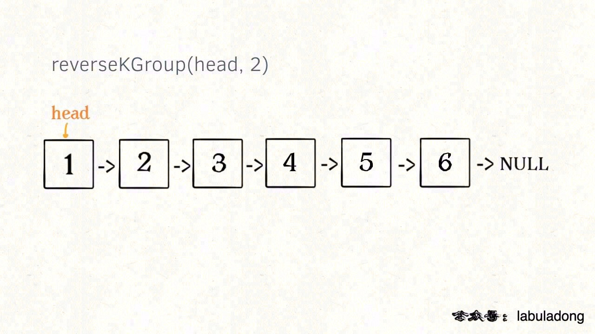
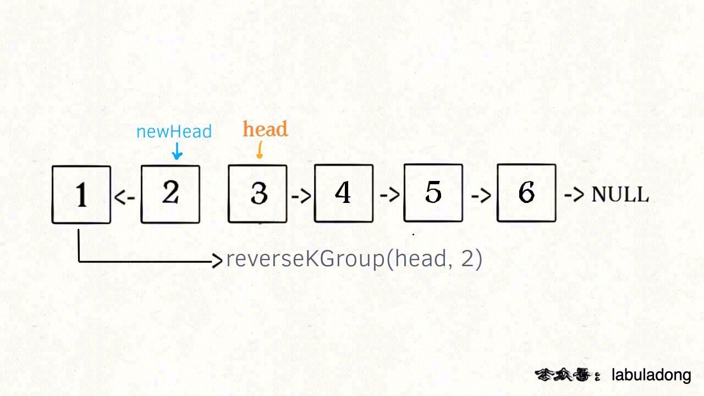
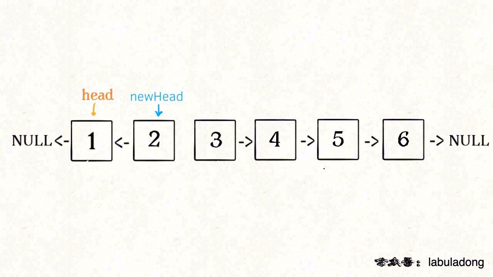
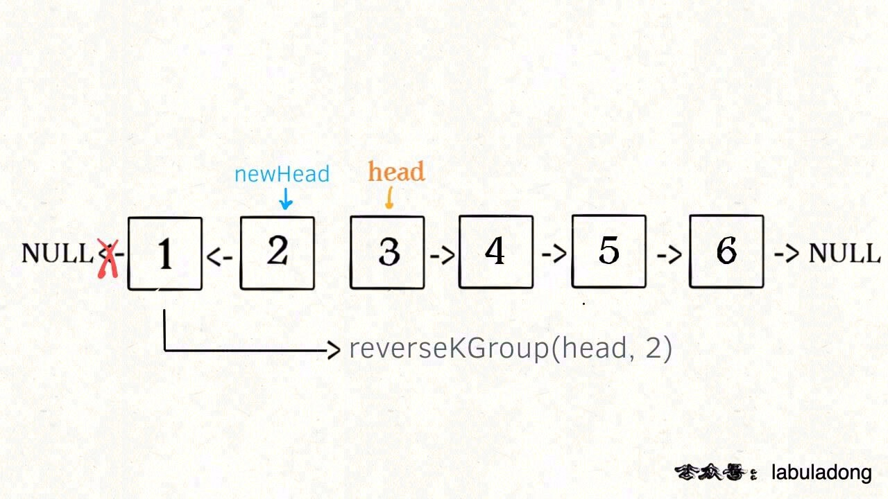
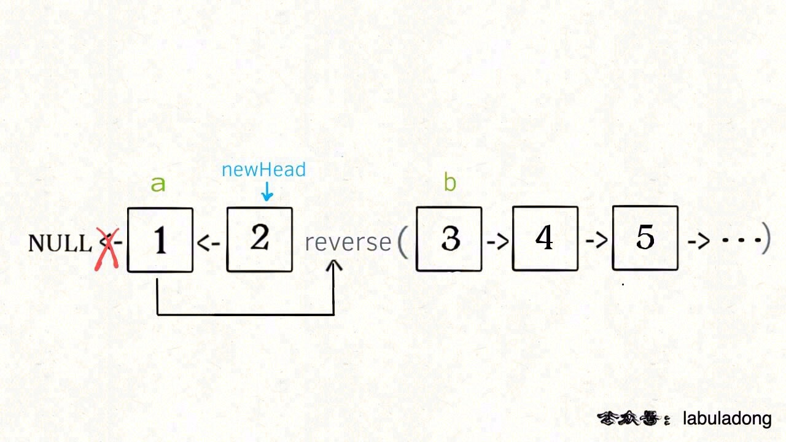
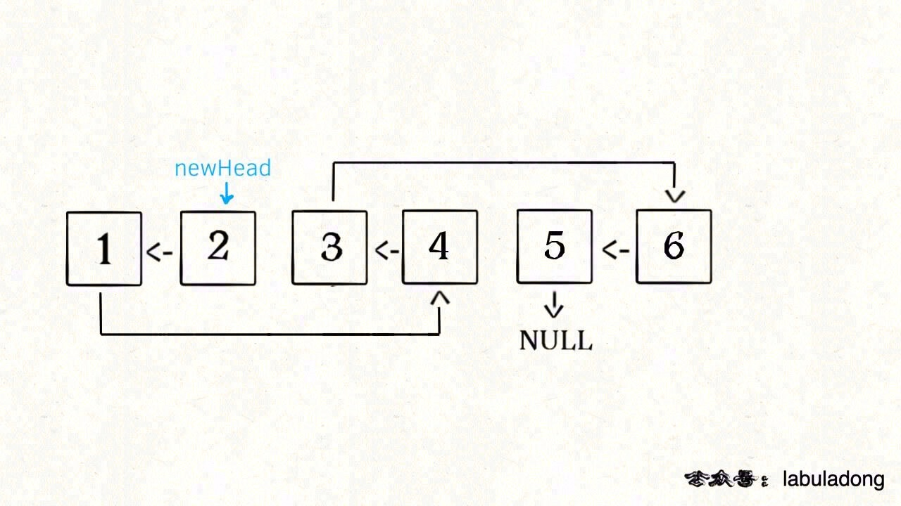

# k个一组反转链表

本文要解决力扣第 25 题「 K 个一组翻转链表」，题目不难理解：



这个问题经常在面经中看到，而且力扣上难度是 Hard，它真的有那么难吗？

对于基本数据结构的算法问题其实都不难，只要结合特点一点点拆解分析，一般都没啥难点。下面我们就来拆解一下这个问题。

## 分析问题

首先，前文 学习数据结构的框架思维提到过，链表是一种兼具递归和迭代性质的数据结构，认真思考一下可以发现这个问题具有递归性质。

什么叫递归性质？直接上图理解，比如说我们对这个链表调用 reverseKGroup(head, 2)，即以 2 个节点为一组反转链表：



如果我设法把前 2 个节点反转，那么后面的那些节点怎么处理？后面的这些节点也是一条链表，而且规模（长度）比原来这条链表小，这就叫子问题。



我们可以把原先的 head 指针移动到后面这一段链表的开头，然后继续递归调用 reverseKGroup(head, 2)，因为子问题（后面这部分链表）和原问题（整条链表）的结构完全相同，这就是所谓的递归性质。

发现了递归性质，就可以得到大致的算法流程：

1、先反转以 head 开头的 k 个元素。



2、将第 k + 1 个元素作为 head 递归调用 reverseKGroup 函数。


3、将上述两个过程的结果连接起来。



整体思路就是这样了，最后一点值得注意的是，递归函数都有个 base case，对于这个问题是什么呢？

题目说了，如果最后的元素不足 k 个，就保持不变。这就是 base case，待会会在代码里体现。

## 代码实现

首先，我们要实现一个 reverse 函数反转一个区间之内的元素。在此之前我们再简化一下，给定链表头结点，如何反转整个链表？

```
// 反转以 a 为头结点的链表
ListNode reverse(ListNode a) {
    ListNode pre, cur, nxt;
    pre = null; cur = a; nxt = a;
    while (cur != null) {
        nxt = cur.next;
        // 逐个结点反转
        cur.next = pre;
        // 更新指针位置
        pre = cur;
        cur = nxt;
    }
    // 返回反转后的头结点
    return pre;
}
```

这次使用迭代思路来实现的。

「反转以 a 为头结点的链表」其实就是「反转 a 到 null 之间的结点」，那么如果让你「反转 a 到 b 之间的结点」，你会不会？

只要更改函数签名，并把上面的代码中 null 改成 b 即可：

```
/** 反转区间 [a, b) 的元素，注意是左闭右开 */
ListNode reverse(ListNode a, ListNode b) {
    ListNode pre, cur, nxt;
    pre = null; cur = a; nxt = a;
    // while 终止的条件改一下就行了
    while (cur != b) {
        nxt = cur.next;
        cur.next = pre;
        pre = cur;
        cur = nxt;
    }
    // 返回反转后的头结点
    return pre;
}
```

现在我们迭代实现了反转部分链表的功能，接下来就按照之前的逻辑编写 reverseKGroup 函数即可：

```
ListNode reverseKGroup(ListNode head, int k) {
    if (head == null) return null;
    // 区间 [a, b) 包含 k 个待反转元素
    ListNode a, b;
    a = b = head;
    for (int i = 0; i < k; i++) {
        // 不足 k 个，不需要反转，base case
        if (b == null) return head;
        b = b.next;
    }
    // 反转前 k 个元素
    ListNode newHead = reverse(a, b);
    // 递归反转后续链表并连接起来
    a.next = reverseKGroup(b, k);
    return newHead;
}
```

解释一下 for 循环之后的几句代码，注意 reverse 函数是反转区间 [a, b)，所以情形是这样的：



递归部分就不展开了，整个函数递归完成之后就是这个结果，完全符合题意：

