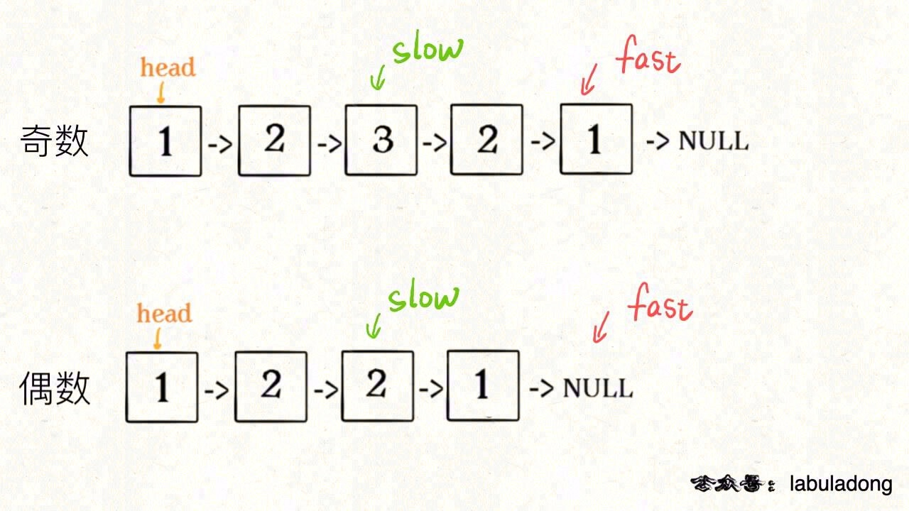
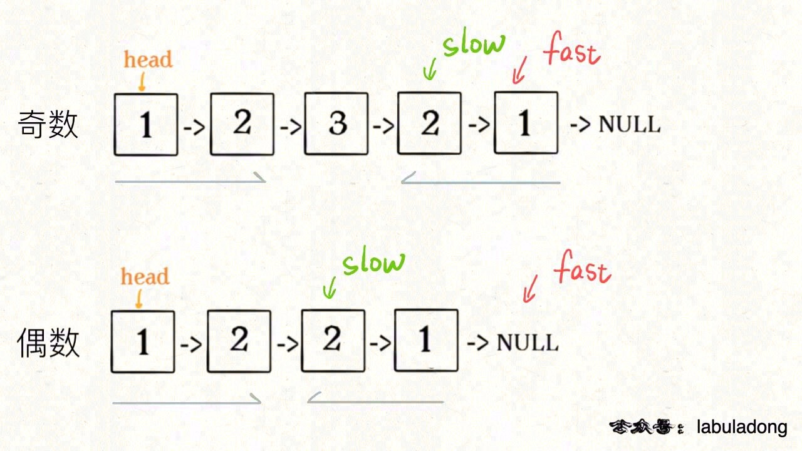

# 判断回文链表

首先，寻找回文串是从中间向两端扩展，判断回文串是从两端向中间收缩。对于单链表，无法直接倒序遍历，可以造一条新的反转链表，可以利用链表的后序遍历，也可以用栈结构倒序处理单链表。

具体到回文链表的判断问题，由于回文的特殊性，可以不完全反转链表，而是仅仅反转部分链表，将空间复杂度降到 O(1)。

因为回文串是对称的，所以正着读和倒着读应该是一样的，这一特点是解决回文串问题的关键。

## 最优解

不用额外的空间，解决这个问题。

更好的思路是这样的：

1、先通过 双指针技巧 中的快慢指针来找到链表的中点：

```
ListNode slow, fast;
slow = fast = head;
while (fast != null && fast.next != null) {
    slow = slow.next;
    fast = fast.next.next;
}
// slow 指针现在指向链表中点
```



2、如果fast指针没有指向null，说明链表长度为奇数，slow还要再前进一步：

```
if (fast != null)
    slow = slow.next;
```



3、从slow开始反转后面的链表，现在就可以开始比较回文串了：

```
ListNode left = head;
ListNode right = reverse(slow);

while (right != null) {
    if (left.val != right.val)
        return false;
    left = left.next;
    right = right.next;
}
return true;
```

至此，把上面 3 段代码合在一起就高效地解决这个问题了，其中 reverse 函数很容易实现：

```
boolean isPalindrome(ListNode head) {
    ListNode slow, fast;
    slow = fast = head;
    while (fast != null && fast.next != null) {
        slow = slow.next;
        fast = fast.next.next;
    }
    
    if (fast != null)
        slow = slow.next;
    
    ListNode left = head;
    ListNode right = reverse(slow);
    while (right != null) {
        if (left.val != right.val)
            return false;
        left = left.next;
        right = right.next;
    }
    
    return true;
}

ListNode reverse(ListNode head) {
    ListNode pre = null, cur = head;
    while (cur != null) {
        ListNode next = cur.next;
        cur.next = pre;
        pre = cur;
        cur = next;
    }
    return pre;
}
```

算法总体的时间复杂度 O(N)，空间复杂度 O(1)，已经是最优的了。