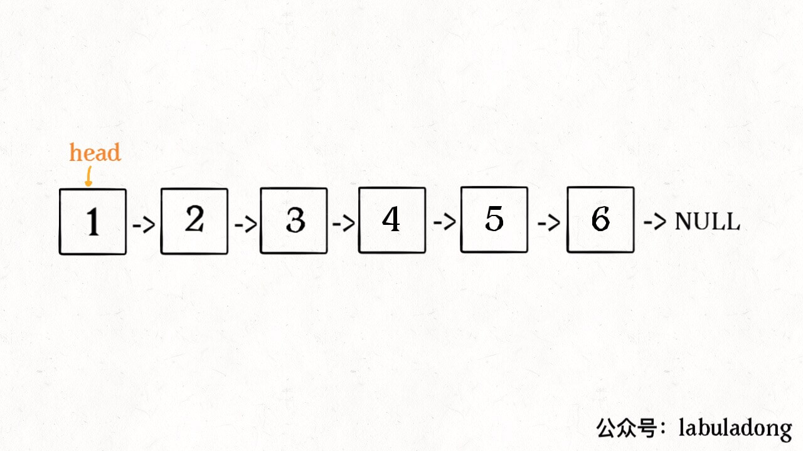
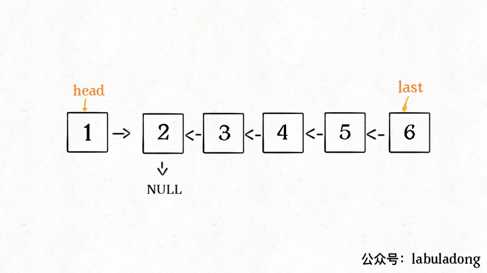
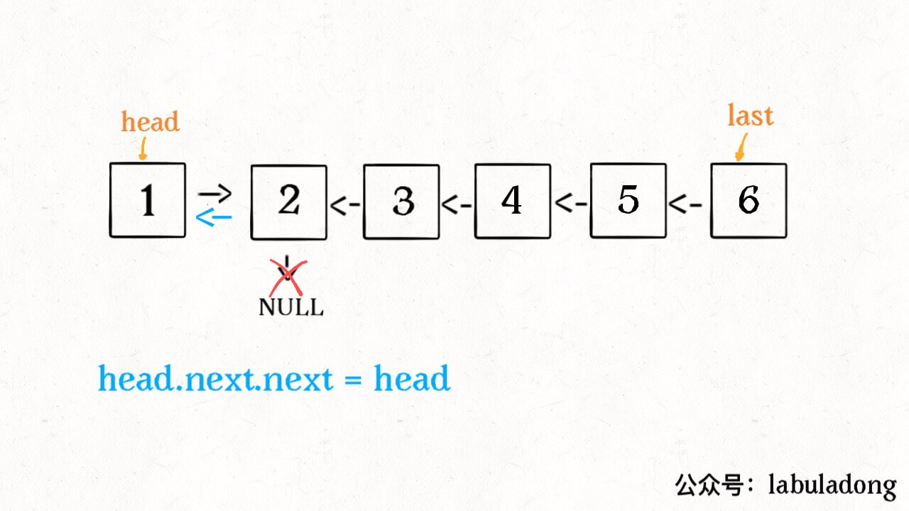

# 反转链表

两种方法：
- 递归
- 迭代

## 递归

```java
ListNode reverse(ListNode head) {
    if (head == null || head.next == null) {
        return head;
    }
    ListNode last = reverse(head.next);
    head.next.next = head;
    head.next = null;
    return last;
}
```

看起来是不是感觉不知所云，完全不能理解这样为什么能够反转链表？这就对了，这个算法常常拿来显示递归的巧妙和优美，我们下面来详细解释一下这段代码。

对于递归算法，最重要的就是明确递归函数的定义。具体来说，我们的 reverse 函数定义是这样的：s

输入一个节点 head，将「以 head 为起点」的链表反转，并返回反转之后的头结点。

明白了函数的定义，再来看这个问题。比如说我们想反转这个链表：



那么输入 reverse(head) 后，会在这里进行递归：

```
ListNode last = reverse(head.next);
```

不要跳进递归（你的脑袋能压几个栈呀？），而是要根据刚才的函数定义，来弄清楚这段代码会产生什么结果：


这个 reverse(head.next) 执行完成后，整个链表就成了这样：



并且根据函数定义，reverse 函数会返回反转之后的头结点，我们用变量 last 接收了。

现在再来看下面的代码：

```
head.next.next = head;
```



接下来：

```
head.next = null;
return last;
```


神不神奇，这样整个链表就反转过来了！递归代码就是这么简洁优雅，不过其中有个地方需要注意：

1. 递归函数要有 base case，也就是这句：
```
if (head == null || head.next == null) {
        return head;
    }
```

意思是如果链表只有一个节点或者是空节点的时候反转也是它自己，直接返回即可。