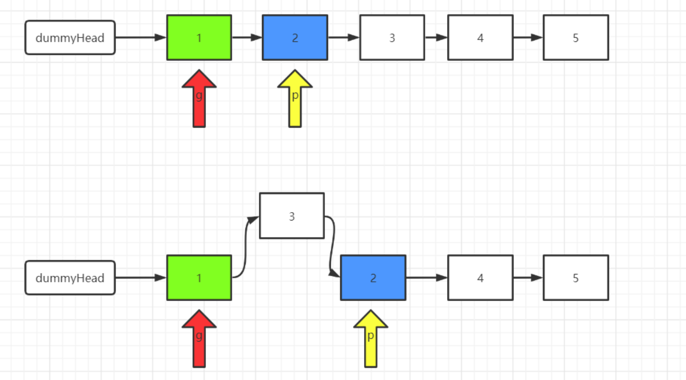
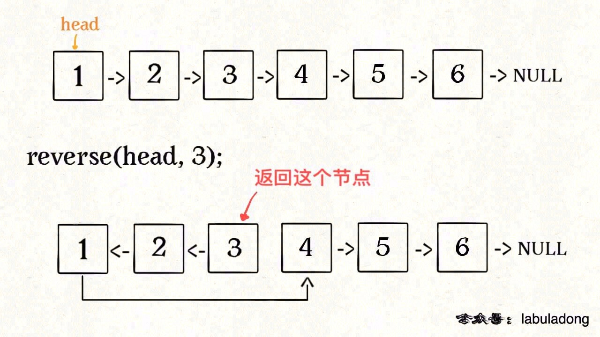
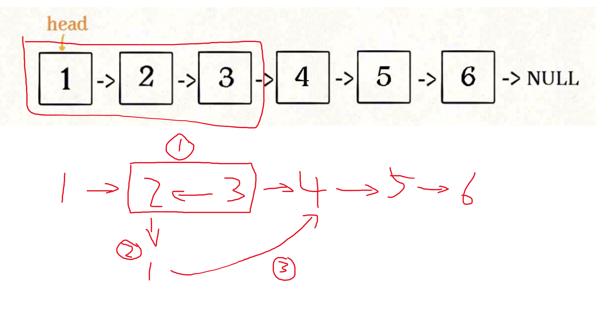

# 反转链表的一部分

## 迭代法

一个for循环就能解决问题。头插法。

1. 新增 dummyHead, 方便后续操作。
2. 定义2个指针，分别为 guard 和 cur。guard 移动到第一个要反转节点的前一个节点（后续guard不变，一直在这个位置）。cur 移动到第一个要反转的节点的位置上。
3. 头插法。将 cur 后面的节点删掉，然后添加到 guard 的后面。
4. 根据函数参数 left 和 right，重复步骤3。
5. 返回 dummyHead.Next。



## 递归法

先看一个问题：反转链表前 N 个节点。

### 反转链表前N个节点

这次我们实现一个这样的函数：

```
// 将链表的前 n 个节点反转（n <= 链表长度）
ListNode reverseN(ListNode head, int n)
```

比如说对于下图链表，执行 reverseN(head, 3)：



解决思路和反转整个链表差不多，只要稍加修改即可：

```
ListNode successor = null; // 后驱节点

// 反转以 head 为起点的 n 个节点，返回新的头结点
ListNode reverseN(ListNode head, int n) {
    if (n == 1) {
        // 记录第 n + 1 个节点
        successor = head.next;
        return head;
    }
    // 以 head.next 为起点，需要反转前 n - 1 个节点
    ListNode last = reverseN(head.next, n - 1);

    head.next.next = head;
    // 让反转之后的 head 节点和后面的节点连起来
    head.next = successor;
    return last;
}
```

具体的区别：

1、base case 变为 n == 1，反转一个元素，就是它本身，同时要记录后驱节点。

2、刚才我们直接把 head.next 设置为 null，因为整个链表反转后原来的 head 变成了整个链表的最后一个节点。但现在 head 节点在递归反转之后不一定是最后一个节点了，所以要记录后驱 successor（第 n + 1 个节点），反转之后将 head 连接上。



### 反转链表的一部分

现在解决我们最开始提出的问题，给一个索引区间 [m,n]（索引从 1 开始），仅仅反转区间中的链表元素。

```
ListNode reverseBetween(ListNode head, int m, int n)
```

首先，如果 m == 1，就相当于反转链表开头的 n 个元素嘛，也就是我们刚才实现的功能：

```
ListNode reverseBetween(ListNode head, int m, int n) {
    // base case
    if (m == 1) {
        // 相当于反转前 n 个元素
        return reverseN(head, n);
    }
    // ...
}
```

如果 m != 1 怎么办？之前我们把 head 的索引视为 1，那么我们是想从第 m 个元素开始反转；如果把 head.next 的索引视为 1 呢？那么相对于 head.next，反转的区间应该是从第 m - 1 个元素开始的；那么对于 head.next.next 呢……

区别于迭代思想，这就是递归思想，所以我们可以完成代码：

```
ListNode reverseBetween(ListNode head, int m, int n) {
    // base case
    if (m == 1) {
        return reverseN(head, n);
    }
    // 前进到反转的起点触发 base case
    head.next = reverseBetween(head.next, m - 1, n - 1);
    return head;
}
```