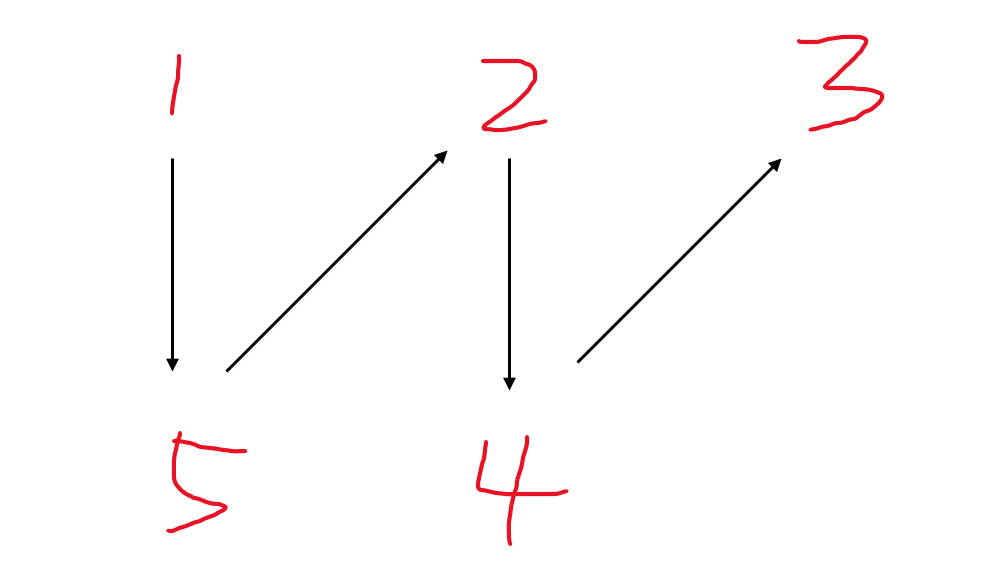

# 重排链表

## 方法1：线性表

因为链表不支持下标访问，所以我们无法随机访问链表中任意位置的元素。

因此比较容易想到的一个方法是，我们利用线性表存储该链表，然后利用线性表可以下标访问的特点，直接按顺序访问指定元素，重建该链表即可。

## 方法2：寻找链表中点 + 链表逆序 + 合并链表

注意到目标链表即为将原链表的左半端和反转后的右半端合并后的结果。

这样我们的任务即可划分为三步：

1. 找到原链表的中点。
2. 将原链表的右半端反转。
3. 将原链表的两端合并。因为两链表长度相差不超过 11，因此直接合并即可。

合并逻辑如下：

