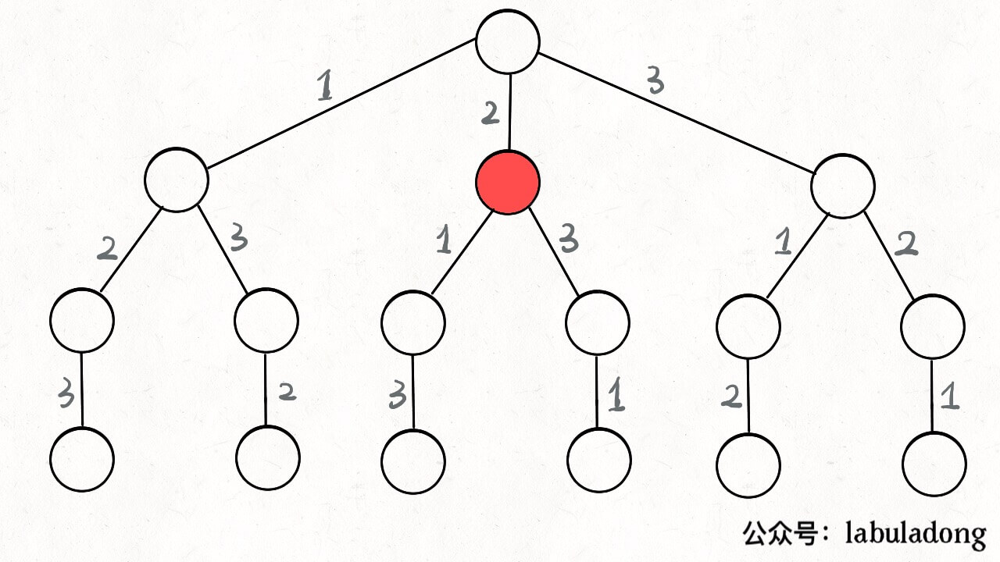

# 全排列

## 回溯算法框架

其实回溯算法其实就是我们常说的 DFS 算法，本质上就是一种暴力穷举算法。

废话不多说，直接上回溯算法框架。解决一个回溯问题，实际上就是一个决策树的遍历过程。

站在回溯树的一个节点上，你只需要思考 3 个问题：

1、路径：也就是已经做出的选择。

2、选择列表：也就是你当前可以做的选择。

3、结束条件：也就是到达决策树底层，无法再做选择的条件。

回溯算法的框架：

```
result = []
def backtrack(路径, 选择列表):
    if 满足结束条件:
        result.add(路径)
        return
    
    for 选择 in 选择列表:
        做选择
        backtrack(路径, 选择列表)
        撤销选择
```

其核心就是 for 循环里面的递归，在递归调用之前「做选择」，在递归调用之后「撤销选择」，特别简单。

## 全排列解法

力扣第 46 题「 全排列」就是给你输入一个数组 nums，让你返回这些数字的全排列。

我们在高中的时候就做过排列组合的数学题，我们也知道 n 个不重复的数，全排列共有 n! 个。那么我们当时是怎么穷举全排列的呢？

比方说给三个数 [1,2,3]，你肯定不会无规律地乱穷举，一般是这样：

先固定第一位为 1，然后第二位可以是 2，那么第三位只能是 3；然后可以把第二位变成 3，第三位就只能是 2 了；然后就只能变化第一位，变成 2，然后再穷举后两位……

其实这就是回溯算法，我们高中无师自通就会用，或者有的同学直接画出如下这棵回溯树：


只要从根遍历这棵树，记录路径上的数字，其实就是所有的全排列。我们不妨把这棵树称为回溯算法的「决策树」。

为啥说这是决策树呢，因为你在每个节点上其实都在做决策。比如说你站在下图的红色节点上：



你现在就在做决策，可以选择 1 那条树枝，也可以选择 3 那条树枝。为啥只能在 1 和 3 之中选择呢？因为 2 这个树枝在你身后，这个选择你之前做过了，而全排列是不允许重复使用数字的。

现在可以解答开头的几个名词：[2] 就是「路径」，记录你已经做过的选择；[1,3] 就是「选择列表」，表示你当前可以做出的选择；「结束条件」就是遍历到树的底层叶子节点，这里也就是选择列表为空的时候。

直接看全部代码：

```
package main

import "fmt"

func main() {
	nums := []int{1, 2, 3}
	res := permute(nums)
	fmt.Printf("res: %v\n", res)
}

func permute(nums []int) [][]int {
	n := len(nums)
	track := make([]int, 0)
	res := make([][]int, 0)
	used := make([]bool, n) // default: false
	backtrack(nums, &track, &res, &used)
	return res
}

func backtrack(nums []int, track *[]int, res *[][]int, visited *[]bool) {
	if len(nums) == len(*track) {
		// 这儿有个大坑，不能直接*res = append(*res, *track)
		// 必须要重新生成一个新的track对象
		// 因为track是一个外部引用，在遍历过程中track 中的数据会不断变化，所以装入 res 的时候应该把 track 里面的值做一次拷贝。
		t := make([]int, len(*track))
		copy(t, *track)
		*res = append(*res, t)
		return
	}
	for i, v := range nums {
		if (*visited)[i] {
			continue
		}
		*track = append(*track, v)
		(*visited)[i] = true
		backtrack(nums, track, res, visited)
		*track = (*track)[:len(*track)-1]
		(*visited)[i] = false
	}
}
```

我们这里稍微做了些变通，没有显式记录「选择列表」，而是通过 used 数组排除已经存在 track 中的元素，从而推导出当前的选择列表。

至此，我们就通过全排列问题详解了回溯算法的底层原理。当然，这个算法解决全排列不是最高效的，你可能看到有的解法连 used 数组都不使用，通过交换元素达到目的。但是那种解法稍微难理解一些，这里就不写了，有兴趣可以自行搜索一下。

## 最大的坑

base case里有个大坑，不能直接*res = append(*res, *track)。必须要重新生成一个新的track对象。因为track是一个外部引用，在遍历过程中track 中的数据会不断变化，所以装入 res 的时候应该把 track 里面的值做一次拷贝。

## Follow up

但如果题目不让你算全排列，而是让你算元素个数为 k 的排列，怎么算？

也很简单，改下 backtrack 函数的 base case，仅收集第 k 层的节点值即可：

```
// 回溯算法核心函数
void backtrack(int[] nums, int k) {
    // base case，到达第 k 层，收集节点的值
    if (track.size() == k) {
        // 第 k 层节点的值就是大小为 k 的排列
        res.add(new LinkedList(track));
        return;
    }

    // 回溯算法标准框架
    for (int i = 0; i < nums.length; i++) {
        // ...
        backtrack(nums, k);
        // ...
    }
}
```