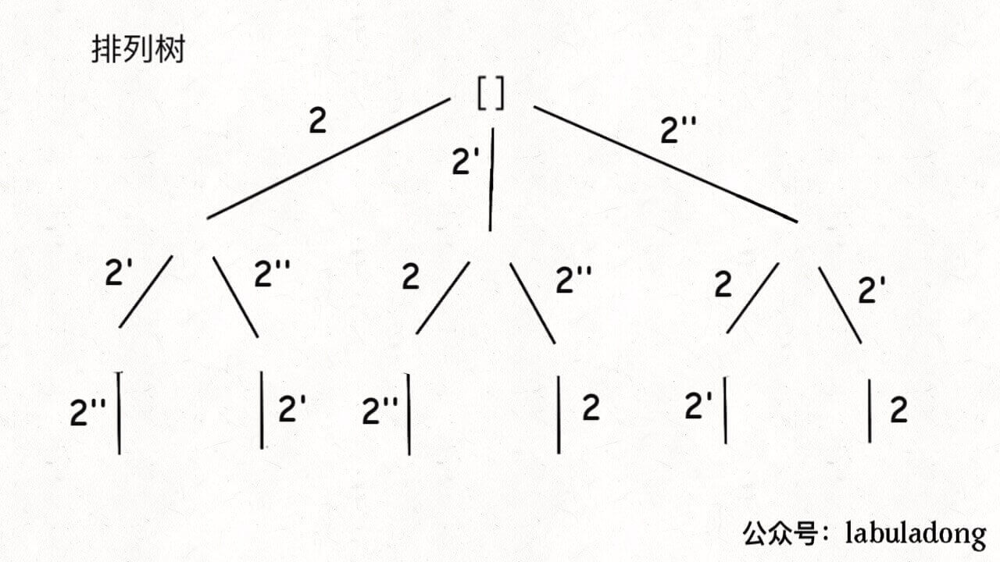
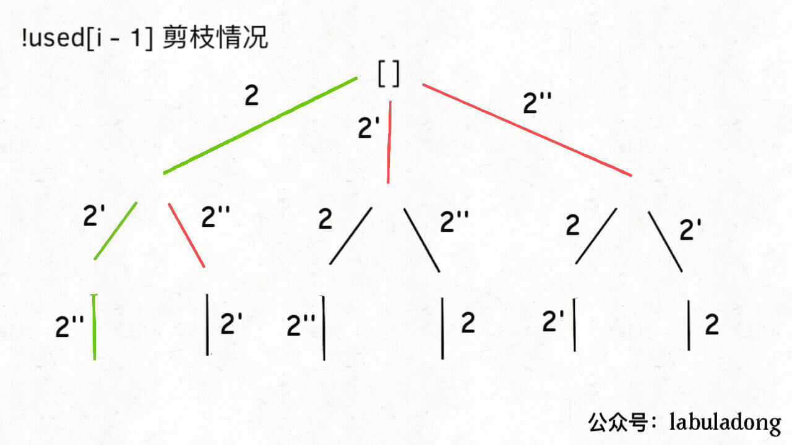
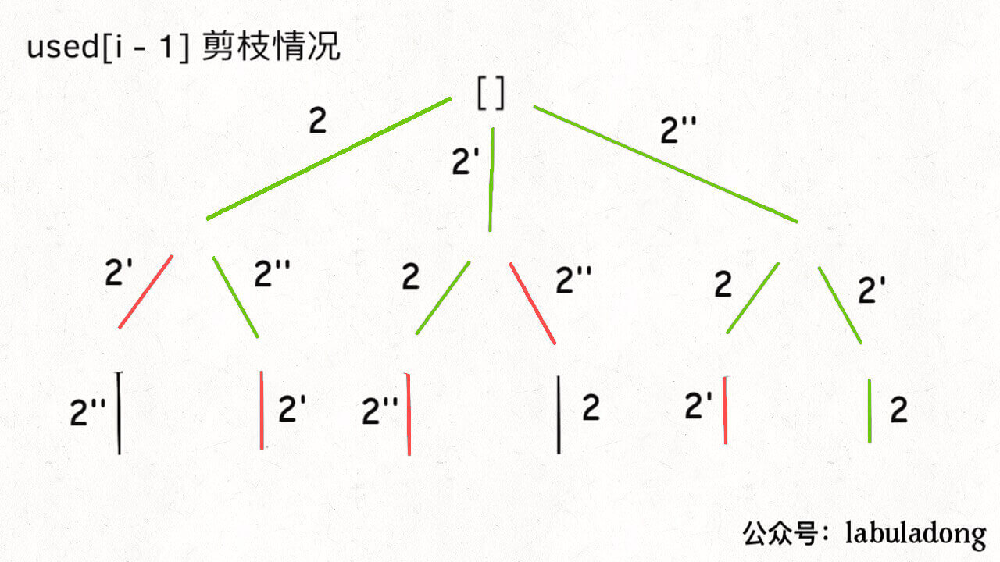

# 全排列II

47。给你输入一个可包含重复数字的序列 nums，请你写一个算法，返回所有不重复的全排列。

排列问题的输入如果存在重复，比子集/组合问题稍微复杂一点。

组合的输入数组如果存在重复，剪枝条件是 i > 0 && nums[i] == nums[i-1]。

而排列的输入如果存在重复，剪枝条件在组合的基础上，还要再多一个，就是i > 0 && nums[i] == nums[i-1] && !used[i - 1]。

- nums[i] == nums[i-1]是回溯树中，每一层横向的，是遍历选择列表那里。
- !used[i - 1]是回溯树中纵向的。是当前track中，已经选过的元素。

为什么组合不需要判断纵向，只需要判断横向呢？

因为组合，回溯树不是满的，是从左到右变少的，右边的天生不会和左边的重复。组合的重复结果只可能是横向带来的。而排列，结果的重复既可能是横向带来的，也可能是纵向带来的。

先看解法：

```
List<List<Integer>> res = new LinkedList<>();
LinkedList<Integer> track = new LinkedList<>();
boolean[] used;

public List<List<Integer>> permuteUnique(int[] nums) {
    // 先排序，让相同的元素靠在一起
    Arrays.sort(nums);
    used = new boolean[nums.length];
    backtrack(nums);
    return res;
}

void backtrack(int[] nums) {
    if (track.size() == nums.length) {
        res.add(new LinkedList(track));
        return;
    }

    for (int i = 0; i < nums.length; i++) {
        if (used[i]) {
            continue;
        }
        // 新添加的剪枝逻辑，固定相同的元素在排列中的相对位置
        if (i > 0 && nums[i] == nums[i - 1] && !used[i - 1]) {
            continue;
        }
        track.add(nums[i]);
        used[i] = true;
        backtrack(nums);
        track.removeLast();
        used[i] = false;
    }
}
```

和原全排列的区别，就是去重。区别只有2点：

1、对 nums 进行了排序。

2、添加了一句额外的剪枝逻辑。

这个地方理解起来就需要一些技巧性了，且听我慢慢到来。为了方便研究，依然把相同的元素用上标 ' 以示区别。

假设输入为 nums = [1,2,2']，标准的全排列算法会得出如下答案：

```
[
    [1,2,2'],[1,2',2],
    [2,1,2'],[2,2',1],
    [2',1,2],[2',2,1]
]
```

显然，这个结果存在重复，比如 [1,2,2'] 和 [1,2',2] 应该只被算作同一个排列，但被算作了两个不同的排列。

所以现在的关键在于，如何设计剪枝逻辑，把这种重复去除掉？

答案是，保证相同元素在排列中的相对位置保持不变。

比如说 nums = [1,2,2'] 这个例子，我保持排列中 2 一直在 2' 前面。

这样的话，你从上面 6 个排列中只能挑出 3 个排列符合这个条件：

```
[ [1,2,2'],[2,1,2'],[2,2',1] ]
```

这也就是正确答案。

进一步，如果 nums = [1,2,2',2'']，我只要保证重复元素 2 的相对位置固定，比如说 2 -> 2' -> 2''，也可以得到无重复的全排列结果。

仔细思考，应该很容易明白其中的原理：

标准全排列算法之所以出现重复，是因为把相同元素形成的排列序列视为不同的序列，但实际上它们应该是相同的；而如果固定相同元素形成的序列顺序，当然就避免了重复。

那么反映到代码上，你注意看这个剪枝逻辑：

```
// 新添加的剪枝逻辑，固定相同的元素在排列中的相对位置
if (i > 0 && nums[i] == nums[i - 1] && !used[i - 1]) {
    // 如果前面的相邻相等元素没有用过，则跳过
    continue;
}
// 选择 nums[i]
```

当出现重复元素时，比如输入 nums = [1,2,2',2'']，2' 只有在 2 已经被使用的情况下才会被选择，同理，2'' 只有在 2' 已经被使用的情况下才会被选择，这就保证了相同元素在排列中的相对位置保证固定。

这里拓展一下，如果你把上述剪枝逻辑中的 !used[i - 1] 改成 used[i - 1]，其实也可以通过所有测试用例，但效率会有所下降，这是为什么呢？

之所以这样修改不会产生错误，是因为这种写法相当于维护了 2'' -> 2' -> 2 的相对顺序，最终也可以实现去重的效果。

但为什么这样写效率会下降呢？因为这个写法剪掉的树枝不够多。

比如输入 nums = [2,2',2'']，产生的回溯树如下：



如果用绿色树枝代表 backtrack 函数遍历过的路径，红色树枝代表剪枝逻辑的触发，那么 !used[i - 1] 这种剪枝逻辑得到的回溯树长这样：



而 used[i - 1] 这种剪枝逻辑得到的回溯树如下：



可以看到，!used[i - 1] 这种剪枝逻辑剪得干净利落，而 used[i - 1] 这种剪枝逻辑虽然也能得到无重结果，但它剪掉的树枝较少，存在的无效计算较多，所以效率会差一些。