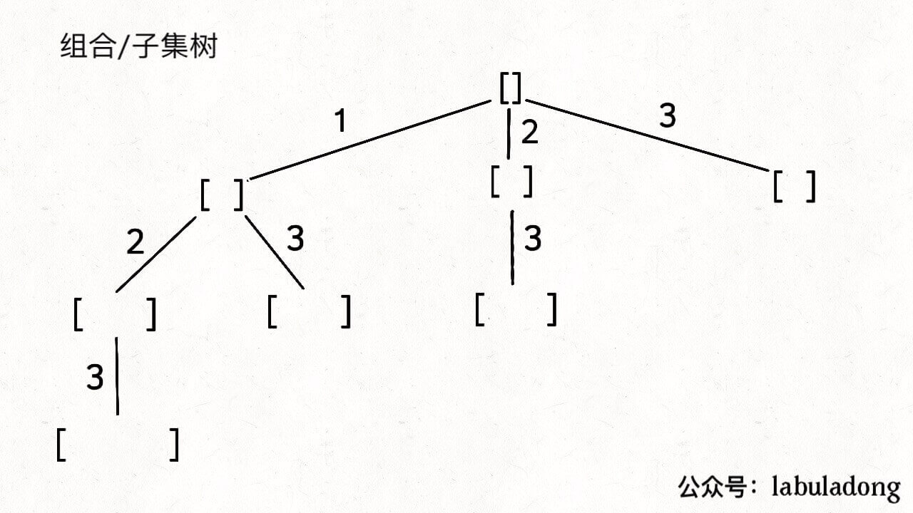
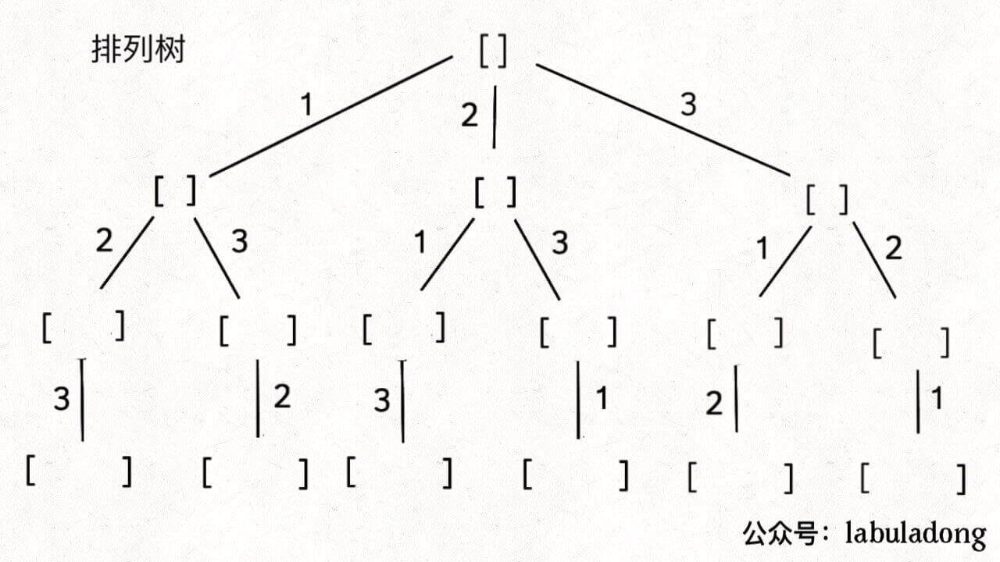

# 子集 组合 排列问题总结

虽然排列、组合、子集系列问题是高中就学过的，但如果想编写算法解决它们，还是非常考验计算机思维的，本文就讲讲编程解决这几个问题的核心思路，以后再有什么变体，你也能手到擒来，以不变应万变。

无论是排列、组合还是子集问题，简单说无非就是让你从序列 nums 中以给定规则取若干元素，主要有以下几种变体：

**形式一、元素无重不可复选，即 nums 中的元素都是唯一的，每个元素最多只能被使用一次，这也是最基本的形式。**

以组合为例，如果输入 nums = [2,3,6,7]，和为 7 的组合应该只有 [7]。

**形式二、元素可重不可复选，即 nums 中的元素可以存在重复，每个元素最多只能被使用一次。**

以组合为例，如果输入 nums = [2,5,2,1,2]，和为 7 的组合应该有两种 [2,2,2,1] 和 [5,2]。

**形式三、元素无重可复选，即 nums 中的元素都是唯一的，每个元素可以被使用若干次。**

以组合为例，如果输入 nums = [2,3,6,7]，和为 7 的组合应该有两种 [2,2,3] 和 [7]。

当然，也可以说有第四种形式，即元素可重可复选。但既然元素可复选，那又何必存在重复元素呢？元素去重之后就等同于形式三，所以这种情况不用考虑。

上面用组合问题举的例子，但排列、组合、子集问题都可以有这三种基本形式，所以共有 9 种变化。

除此之外，题目也可以再添加各种限制条件，比如让你求和为 target 且元素个数为 k 的组合，那这么一来又可以衍生出一堆变体，怪不得面试笔试中经常考到排列组合这种基本题型。

具体来说，你需要先阅读并理解前文 回溯算法核心套路，然后记住如下子集问题和排列问题的回溯树，就可以解决所有排列组合子集相关的问题：





为什么只要记住这两种树形结构就能解决所有相关问题呢？

首先，组合问题和子集问题其实是等价的，这个后面会讲；至于之前说的三种变化形式，无非是在这两棵树上剪掉或者增加一些树枝罢了。

## 总结

来回顾一下排列/组合/子集问题的三种形式在代码上的区别。

由于子集问题和组合问题本质上是一样的，无非就是 base case 有一些区别，所以把这两个问题放在一起看。

形式一、元素无重不可复选，即 nums 中的元素都是唯一的，每个元素最多只能被使用一次，backtrack 核心代码如下：

```
/* 组合/子集问题回溯算法框架 */
void backtrack(int[] nums, int start) {
    // 回溯算法标准框架
    for (int i = start; i < nums.length; i++) {
        // 做选择
        track.addLast(nums[i]);
        // 注意参数
        backtrack(nums, i + 1);
        // 撤销选择
        track.removeLast();
    }
}

/* 排列问题回溯算法框架 */
void backtrack(int[] nums) {
    for (int i = 0; i < nums.length; i++) {
        // 剪枝逻辑
        if (used[i]) {
            continue;
        }
        // 做选择
        used[i] = true;
        track.addLast(nums[i]);

        backtrack(nums);
        // 撤销选择
        track.removeLast();
        used[i] = false;
    }
}
```

形式二、元素可重不可复选，即 nums 中的元素可以存在重复，每个元素最多只能被使用一次，其关键在于排序和剪枝，backtrack 核心代码如下：

```
Arrays.sort(nums);
/* 组合/子集问题回溯算法框架 */
void backtrack(int[] nums, int start) {
    // 回溯算法标准框架
    for (int i = start; i < nums.length; i++) {
        // 剪枝逻辑，跳过值相同的相邻树枝
        if (i > start && nums[i] == nums[i - 1]) {
            continue;
        }
        // 做选择
        track.addLast(nums[i]);
        // 注意参数
        backtrack(nums, i + 1);
        // 撤销选择
        track.removeLast();
    }
}


Arrays.sort(nums);
/* 排列问题回溯算法框架 */
void backtrack(int[] nums) {
    for (int i = 0; i < nums.length; i++) {
        // 剪枝逻辑
        if (used[i]) {
            continue;
        }
        // 剪枝逻辑，固定相同的元素在排列中的相对位置
        if (i > 0 && nums[i] == nums[i - 1] && !used[i - 1]) {
            continue;
        }
        // 做选择
        used[i] = true;
        track.addLast(nums[i]);

        backtrack(nums);
        // 撤销选择
        track.removeLast();
        used[i] = false;
    }
}
```

形式三、元素无重可复选，即 nums 中的元素都是唯一的，每个元素可以被使用若干次，只要删掉去重逻辑即可，backtrack 核心代码如下：

```
/* 组合/子集问题回溯算法框架 */
void backtrack(int[] nums, int start) {
    // 回溯算法标准框架
    for (int i = start; i < nums.length; i++) {
        // 做选择
        track.addLast(nums[i]);
        // 注意参数
        backtrack(nums, i);
        // 撤销选择
        track.removeLast();
    }
}


/* 排列问题回溯算法框架 */
void backtrack(int[] nums) {
    for (int i = 0; i < nums.length; i++) {
        // 做选择
        track.addLast(nums[i]);
        backtrack(nums);
        // 撤销选择
        track.removeLast();
    }
}
```

## 排序（元素无重可复选）

也就是上面总结的第三种形式的排列问题。之前没有讲过。

力扣上没有类似的题目，我们不妨先想一下，nums 数组中的元素无重复且可复选的情况下，会有哪些排列？

比如输入 nums = [1,2,3]，那么这种条件下的全排列共有 3^3 = 27 种：

```
[
  [1,1,1],[1,1,2],[1,1,3],[1,2,1],[1,2,2],[1,2,3],[1,3,1],[1,3,2],[1,3,3],
  [2,1,1],[2,1,2],[2,1,3],[2,2,1],[2,2,2],[2,2,3],[2,3,1],[2,3,2],[2,3,3],
  [3,1,1],[3,1,2],[3,1,3],[3,2,1],[3,2,2],[3,2,3],[3,3,1],[3,3,2],[3,3,3]
]
```

标准的全排列算法利用 used 数组进行剪枝，避免重复使用同一个元素。如果允许重复使用元素的话，直接放飞自我，去除所有 used 数组的剪枝逻辑就行了。

那这个问题就简单了，代码如下：

```
List<List<Integer>> res = new LinkedList<>();
LinkedList<Integer> track = new LinkedList<>();

public List<List<Integer>> permuteRepeat(int[] nums) {
    backtrack(nums);
    return res;
}

// 回溯算法核心函数
void backtrack(int[] nums) {
    // base case，到达叶子节点
    if (track.size() == nums.length) {
        // 收集叶子节点上的值
        res.add(new LinkedList(track));
        return;
    }

    // 回溯算法标准框架
    for (int i = 0; i < nums.length; i++) {
        // 做选择
        track.add(nums[i]);
        // 进入下一层回溯树
        backtrack(nums);
        // 取消选择
        track.removeLast();
    }
}
```