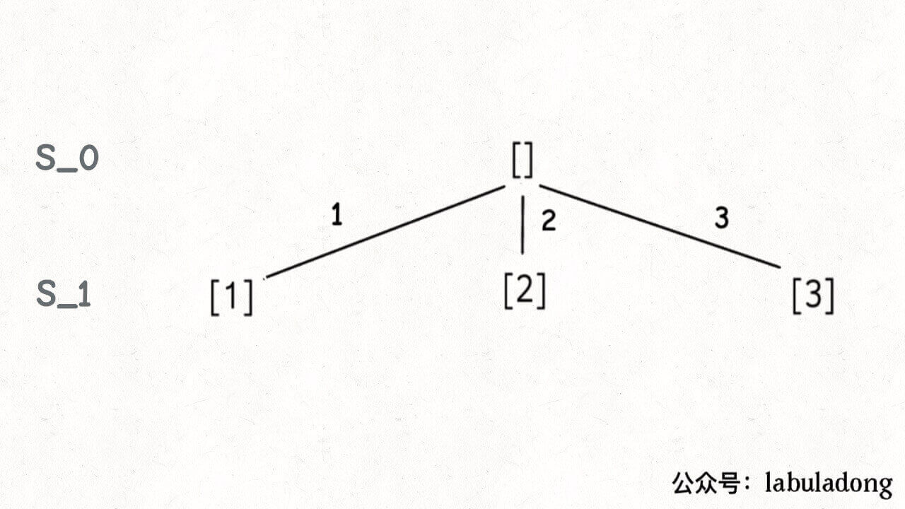
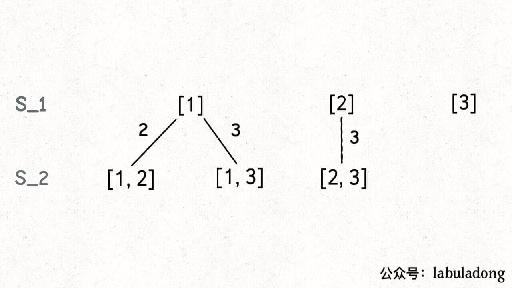
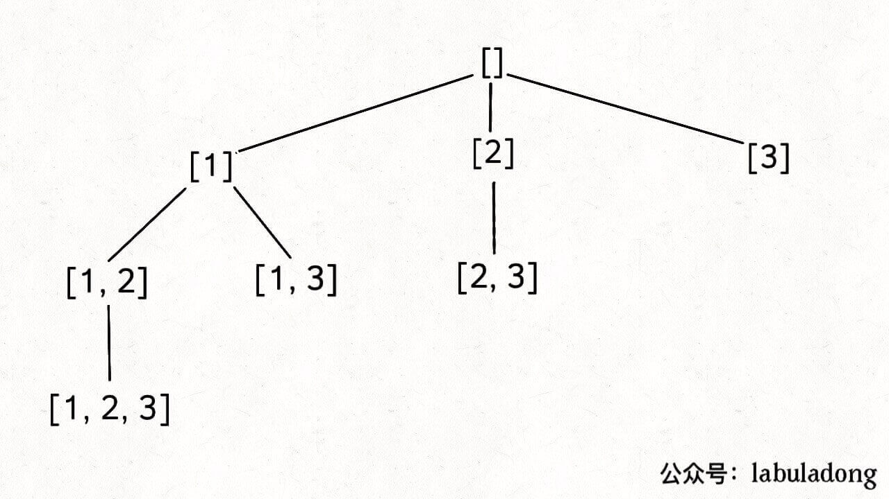
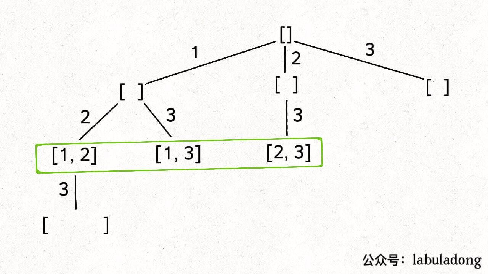

# 子集

78。子集（元素无重不可复选）。组合和子集的题其实是一样的。

题目给你输入一个无重复元素的数组 nums，其中每个元素最多使用一次，请你返回 nums 的所有子集。

比如输入 nums = [1,2,3]，算法应该返回如下子集：

```
[ [],[1],[2],[3],[1,2],[1,3],[2,3],[1,2,3] ]
```

好，我们暂时不考虑如何用代码实现，先回忆一下我们的高中知识，如何手推所有子集？

首先，生成元素个数为 0 的子集，即空集 []，为了方便表示，我称之为 S_0。

然后，在 S_0 的基础上生成元素个数为 1 的所有子集，我称为 S_1：



接下来，我们可以在 S_1 的基础上推导出 S_2，即元素个数为 2 的所有子集：



为什么集合 [2] 只需要添加 3，而不添加前面的 1 呢？

因为集合中的元素不用考虑顺序， [1,2,3] 中 2 后面只有 3，如果你向前考虑 1，那么 [2,1] 会和之前已经生成的子集 [1,2] 重复。

换句话说，我们通过保证元素之间的相对顺序不变来防止出现重复的子集。

接着，我们可以通过 S_2 推出 S_3，实际上 S_3 中只有一个集合 [1,2,3]，它是通过 [1,2] 推出的。

整个推导过程就是这样一棵树：



注意这棵树的特性：

如果把根节点作为第 0 层，将每个节点和根节点之间树枝上的元素作为该节点的值，那么第 n 层的所有节点就是大小为 n 的所有子集。

你比如大小为 2 的子集就是这一层节点的值：



那么再进一步，如果想计算所有子集，那只要遍历这棵多叉树，把所有节点的值收集起来不就行了？

直接看代码：

```
List<List<Integer>> res = new LinkedList<>();
// 记录回溯算法的递归路径
LinkedList<Integer> track = new LinkedList<>();

// 主函数
public List<List<Integer>> subsets(int[] nums) {
    backtrack(nums, 0);
    return res;
}

// 回溯算法核心函数，遍历子集问题的回溯树
void backtrack(int[] nums, int start) {

    // 前序位置，每个节点的值都是一个子集
    res.add(new LinkedList<>(track));
    
    // 回溯算法标准框架
    for (int i = start; i < nums.length; i++) {
        // 做选择
        track.addLast(nums[i]);
        // 通过 start 参数控制树枝的遍历，避免产生重复的子集
        backtrack(nums, i + 1);
        // 撤销选择
        track.removeLast();
    }
}
```

看过前文 回溯算法核心框架 的读者应该很容易理解这段代码吧，我们使用 start 参数控制树枝的生长避免产生重复的子集，用 track 记录根节点到每个节点的路径的值，同时在前序位置把每个节点的路径值收集起来，完成回溯树的遍历就收集了所有子集：


最后，backtrack 函数开头看似没有 base case，会不会进入无限递归？

其实不会的，当 start == nums.length 时，叶子节点的值会被装入 res，但 for 循环不会执行，也就结束了递归。