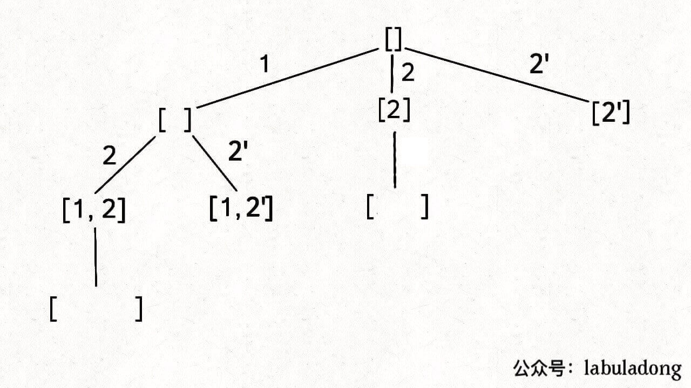
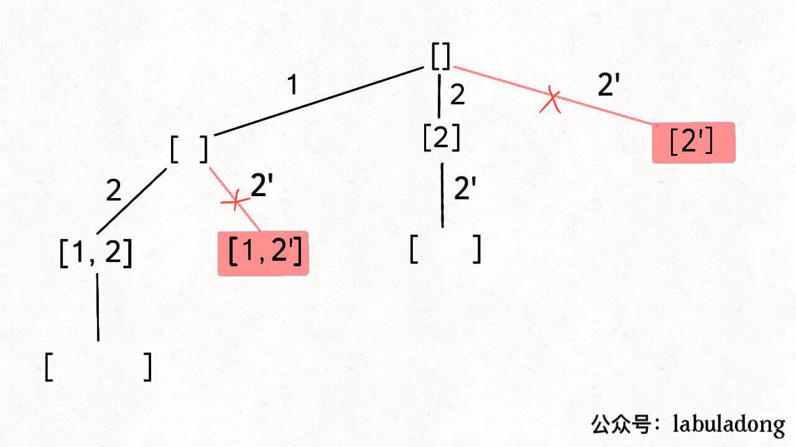

# 子集II

90。子集/组合（元素可重不可复选）。

刚才讲的标准子集问题输入的 nums 是没有重复元素的，但如果存在重复元素，怎么处理呢？

力扣第 90 题「 子集 II」就是这样一个问题：

给你一个整数数组 nums，其中可能包含重复元素，请你返回该数组所有可能的子集。

比如输入 nums = [1,2,2]，你应该输出：

```
[ [],[1],[2],[1,2],[2,2],[1,2,2] ]
```

当然，按道理说「集合」不应该包含重复元素的，但既然题目这样问了，我们就忽略这个细节吧，仔细思考一下这道题怎么做才是正事。

就以 nums = [1,2,2] 为例，为了区别两个 2 是不同元素，后面我们写作 nums = [1,2,2']。

按照之前的思路画出子集的树形结构，显然，两条值相同的相邻树枝会产生重复:



```
[ 
    [],
    [1],[2],[2'],
    [1,2],[1,2'],[2,2'],
    [1,2,2']
]
```

所以我们需要进行剪枝，如果一个节点有多条值相同的树枝相邻，则只遍历第一条，剩下的都剪掉，不要去遍历：



体现在代码上，需要先进行排序，让相同的元素靠在一起，如果发现 nums[i] == nums[i-1]，则跳过：

```
List<List<Integer>> res = new LinkedList<>();
LinkedList<Integer> track = new LinkedList<>();

public List<List<Integer>> subsetsWithDup(int[] nums) {
    // 先排序，让相同的元素靠在一起
    Arrays.sort(nums);
    backtrack(nums, 0);
    return res;
}

void backtrack(int[] nums, int start) {
    // 前序位置，每个节点的值都是一个子集
    res.add(new LinkedList<>(track));
    
    for (int i = start; i < nums.length; i++) {
        // 剪枝逻辑，值相同的相邻树枝，只遍历第一条
        if (i > start && nums[i] == nums[i - 1]) {
            continue;
        }
        track.addLast(nums[i]);
        backtrack(nums, i + 1);
        track.removeLast();
    }
}
```

这段代码和之前标准的子集问题的代码几乎相同，就是添加了排序和剪枝的逻辑。

**为什么nums[i] == nums[i-1]，就能跳过呢？**

因为，同一层的相邻树枝，其实就是选择列表里的所有选择。也就是for循环遍历选择列表那里。nums[i]是当前选择，nums[i-1]是上一个选择。如果当前准备我选择的值，在选择列表中的上一个选择中，已经选择过了，就不用重复选择了。
