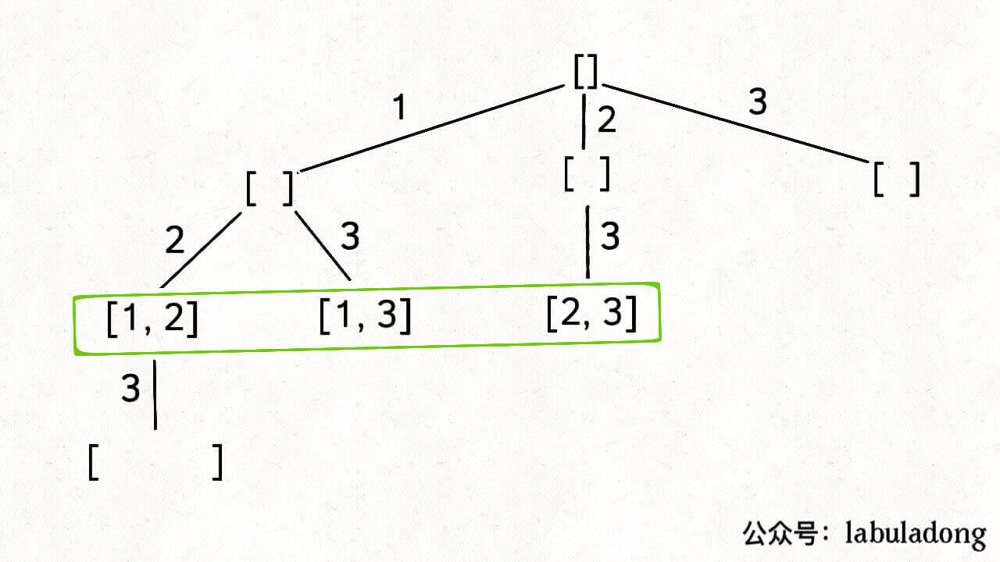

# 组合（元素无重不可复选）

如果你能够成功的生成所有无重子集，那么你稍微改改代码就能生成所有无重组合了。

你比如说，让你在 nums = [1,2,3] 中拿 2 个元素形成所有的组合，你怎么做？

稍微想想就会发现，大小为 2 的所有组合，不就是所有大小为 2 的子集嘛。

所以我说组合和子集是一样的：大小为 k 的组合就是大小为 k 的子集。

比如力扣第 77 题「 组合」：

给定两个整数 n 和 k，返回范围 [1, n] 中所有可能的 k 个数的组合。

比如 combine(3, 2) 的返回值应该是：

```
[ [1,2],[1,3],[2,3] ]
```

这是标准的组合问题，但我给你翻译一下就变成子集问题了：

给你输入一个数组 nums = [1,2..,n] 和一个正整数 k，请你生成所有大小为 k 的子集。

还是以 nums = [1,2,3] 为例，刚才让你求所有子集，就是把所有节点的值都收集起来；现在你只需要把第 2 层（根节点视为第 0 层）的节点收集起来，就是大小为 2 的所有组合：



反映到代码上，只需要稍改 base case，控制算法仅仅收集第 k 层节点的值即可：

```
func combine(n int, k int) [][]int {
	track := make([]int, 0)
	res := make([][]int, 0)
	backtrack(n, k, 1, &track, &res, 0)
	return res
}

func backtrack(n int, k int, start int, track *[]int, res *[][]int, level int) {
	if level == k {
		t := make([]int, len(*track))
		copy(t, *track)
		*res = append(*res, t)
		return
	}
	for i := start; i <= n; i++ {
		*track = append(*track, i)
		backtrack(n, k, i+1, track, res, level+1)
		*track = (*track)[:len(*track)-1]
	}
}
```