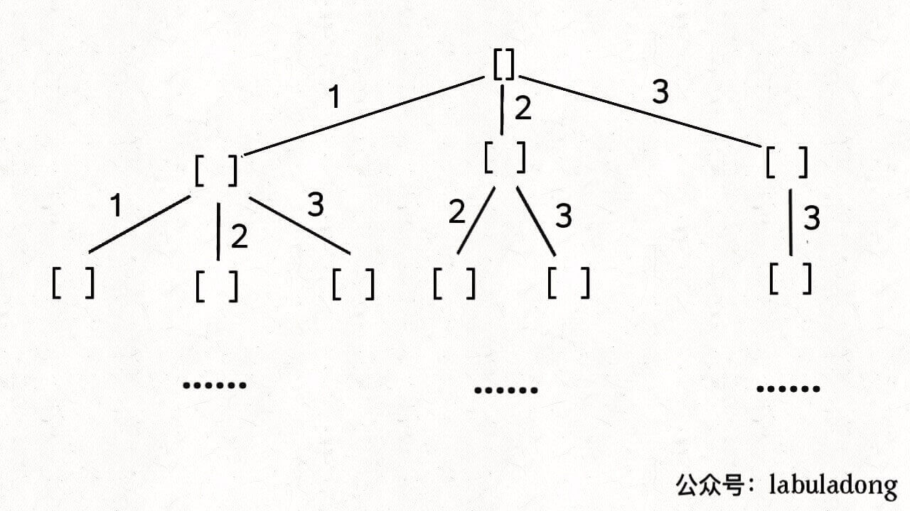

# 组合总和

终于到了最后一种类型了：输入数组无重复元素，但每个元素可以被无限次使用。

直接看力扣第 39 题「 组合总和」：

给你一个无重复元素的整数数组 candidates 和一个目标和 target，找出 candidates 中可以使数字和为目标数 target 的所有组合。candidates 中的每个数字可以无限制重复被选取。

比如输入 candidates = [1,2,3], target = 3，算法应该返回：

```
[ [1,1,1],[1,2],[3] ]
```

这道题说是组合问题，实际上也是子集问题：candidates 的哪些子集的和为 target？

想解决这种类型的问题，也得回到回溯树上，我们不妨先思考思考，标准的子集/组合问题是如何保证不重复使用元素的？

答案在于 backtrack 递归时输入的参数 start：

```
// 无重组合的回溯算法框架
void backtrack(int[] nums, int start) {
    for (int i = start; i < nums.length; i++) {
        // ...
        // 递归遍历下一层回溯树，注意参数
        backtrack(nums, i + 1);
        // ...
    }
}
```

这个 i 从 start 开始，那么下一层回溯树就是从 start + 1 开始，从而保证 nums[start] 这个元素不会被重复使用。

那么反过来，如果我想让每个元素被重复使用，我只要把 i + 1 改成 i 即可：

```
// 可重组合的回溯算法框架
void backtrack(int[] nums, int start) {
    for (int i = start; i < nums.length; i++) {
        // ...
        // 递归遍历下一层回溯树，注意参数
        backtrack(nums, i);
        // ...
    }
}
```

这相当于给之前的回溯树添加了一条树枝，在遍历这棵树的过程中，一个元素可以被无限次使用：



当然，这样这棵回溯树会永远生长下去，所以我们的递归函数需要设置合适的 base case 以结束算法，即路径和大于 target 时就没必要再遍历下去了:

```
// 如果去掉，会出现回溯永远无法终止的问题，导致stack overflow
	if sum > target {
		return
	}
```

## 注意

因为这是一个组合问题，所以遍历选择列表，i必须要从start开始，而不是从0开始。

可以重复选择元素，不是靠遍历选择列表，i从0开始的。而是靠递归调用backtrack时，传的参数i。