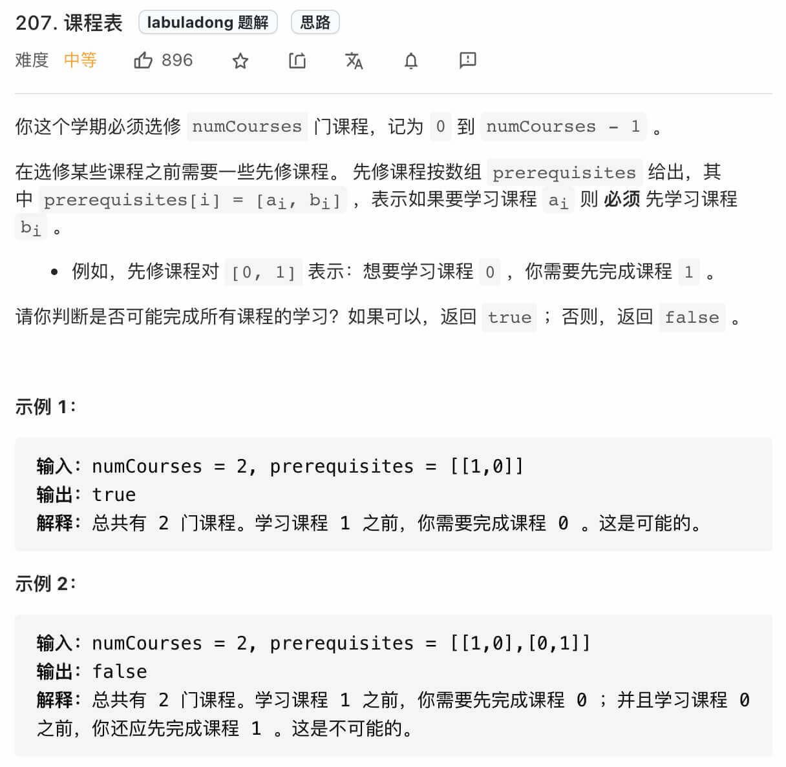
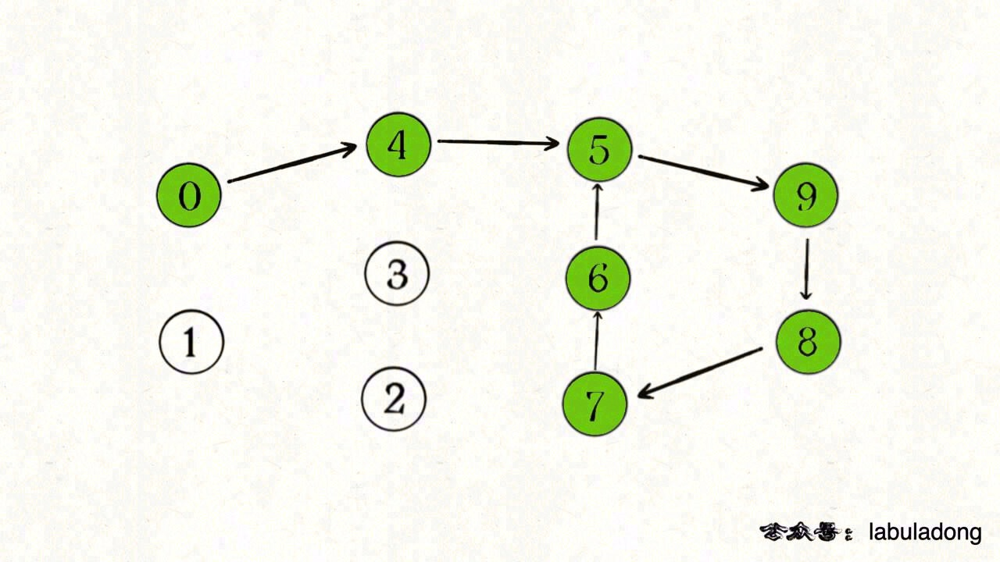

# 课程表

[https://leetcode-cn.com/problems/course-schedule/](https://leetcode-cn.com/problems/course-schedule/)

## DFS 环检测算法



题目应该不难理解，什么时候无法修完所有课程？当存在循环依赖的时候。

其实这种场景在现实生活中也十分常见，比如我们写代码 import 包也是一个例子，必须合理设计代码目录结构，否则会出现循环依赖，编译器会报错，所以编译器实际上也使用了类似算法来判断你的代码是否能够成功编译。

**看到依赖问题，首先想到的就是把问题转化成「有向图」这种数据结构，只要图中存在环，那就说明存在循环依赖。**

具体来说，我们首先可以把课程看成「有向图」中的节点，节点编号分别是 0, 1, ..., numCourses-1，把课程之间的依赖关系看做节点之间的有向边。

比如说必须修完课程 1 才能去修课程 3，那么就有一条有向边从节点 1 指向 3。

**如果发现这幅有向图中存在环，那就说明课程之间存在循环依赖，肯定没办法全部上完；反之，如果没有环，那么肯定能上完全部课程。**

好，那么想解决这个问题，首先我们要把题目的输入转化成一幅有向图，然后再判断图中是否存在环。

如何转换成图呢？我们前文 图论基础 写过图的两种存储形式，邻接矩阵和邻接表。

以我刷题的经验，常见的存储方式是使用邻接表，在go语言中，邻接表也是用 graph [][]int 的形式存储的。

graph[s] 是一个列表，存储着节点 s 所指向的节点。

所以我们首先可以写一个建图函数：

```
// 邻接表
func buildGraph(numCourses int, prerequisites [][]int) [][]int {
	graph := make([][]int, numCourses)
	for i := 0; i < numCourses; i++ {
		graph[i] = make([]int, 0)
	}
	for _, edge := range prerequisites {
		// 这里 from := edge[0], to := edge[1]也可以
		from := edge[1]
		to := edge[0]
		graph[from] = append(graph[from], to)
	}
	return graph
}
```

图建出来了，怎么判断图中有没有环呢？

先不要急，我们先来思考如何遍历这幅图，只要会遍历，就可以判断图中是否存在环了。

前文 图论基础 写了 DFS 算法遍历图的框架，无非就是从多叉树遍历框架扩展出来的，加了个 visited 数组罢了：

```
// 防止重复遍历同一个节点
boolean[] visited;
// 从节点 s 开始 DFS 遍历，将遍历过的节点标记为 true
void traverse(List<Integer>[] graph, int s) {
    if (visited[s]) {
        return;
    }
    /* 前序遍历代码位置 */
    // 将当前节点标记为已遍历
    visited[s] = true;
    for (int t : graph[s]) {
        traverse(graph, t);
    }
    /* 后序遍历代码位置 */
}
```

那么我们就可以直接套用这个遍历代码：

```
// 防止重复遍历同一个节点
boolean[] visited;

boolean canFinish(int numCourses, int[][] prerequisites) {
    List<Integer>[] graph = buildGraph(numCourses, prerequisites);
    
    visited = new boolean[numCourses];
    for (int i = 0; i < numCourses; i++) {
        traverse(graph, i);
    }
}

void traverse(List<Integer>[] graph, int s) {
    // 代码见上文
}
```

注意图中并不是所有节点都相连，所以要用一个 for 循环将所有节点都作为起点调用一次 DFS 搜索算法。

这样，就能遍历这幅图中的所有节点了，你打印一下 visited 数组，应该全是 true。

前文 学习数据结构和算法的框架思维 说过，图的遍历和遍历多叉树差不多，所以到这里你应该都能很容易理解。

现在可以思考如何判断这幅图中是否存在环。

我们前文 回溯算法核心套路详解 说过，你可以把递归函数看成一个在递归树上游走的指针，这里也是类似的：

你也可以把 traverse 看做在图中节点上游走的指针，只需要再添加一个布尔数组 onPath 记录当前 traverse 经过的路径：

```
boolean[] onPath;
boolean[] visited;

boolean hasCycle = false;

void traverse(List<Integer>[] graph, int s) {
    if (onPath[s]) {
        // 发现环！！！
        hasCycle = true;
    }
    if (visited[s] || hasCycle) {
        return;
    }
    // 将节点 s 标记为已遍历
    visited[s] = true;
    // 开始遍历节点 s
    onPath[s] = true;
    for (int t : graph[s]) {
        traverse(graph, t);
    }
    // 节点 s 遍历完成
    onPath[s] = false;
}
```

这里就有点回溯算法的味道了，在进入节点 s 的时候将 onPath[s] 标记为 true，离开时标记回 false，如果发现 onPath[s] 已经被标记，说明出现了环。

注意 visited 数组和 onPath 数组的区别。类比贪吃蛇游戏，visited 记录蛇经过过的格子，而 onPath 仅仅记录蛇身。onPath 用于判断是否成环，类比当贪吃蛇自己咬到自己（成环）的场景。

这样，就可以在遍历图的过程中顺便判断是否存在环了，完整代码如下：

```
// 记录一次递归堆栈中的节点
boolean[] onPath;
// 记录遍历过的节点，防止走回头路
boolean[] visited;
// 记录图中是否有环
boolean hasCycle = false;

boolean canFinish(int numCourses, int[][] prerequisites) {
    List<Integer>[] graph = buildGraph(numCourses, prerequisites);
    
    visited = new boolean[numCourses];
    onPath = new boolean[numCourses];
    
    for (int i = 0; i < numCourses; i++) {
        // 遍历图中的所有节点
        traverse(graph, i);
    }
    // 只要没有循环依赖可以完成所有课程
    return !hasCycle;
}

void traverse(List<Integer>[] graph, int s) {
    if (onPath[s]) {
        // 出现环
        hasCycle = true;
    }
    
    if (visited[s] || hasCycle) {
        // 如果已经找到了环，也不用再遍历了
        return;
    }
    // 前序代码位置
    visited[s] = true;
    onPath[s] = true;
    for (int t : graph[s]) {
        traverse(graph, t);
    }
    // 后序代码位置
    onPath[s] = false;
}

List<Integer>[] buildGraph(int numCourses, int[][] prerequisites) {
    // 代码见前文
}
```

这道题就解决了，核心就是判断一幅有向图中是否存在环。

不过如果出题人继续恶心你，让你不仅要判断是否存在环，还要返回这个环具体有哪些节点，怎么办？

你可能说，onPath 里面为 true 的索引，不就是组成环的节点编号吗？

不是的，假设下图中绿色的节点是递归的路径，它们在 onPath 中的值都是 true，但显然成环的节点只是其中的一部分：



解决此问题的算法，叫做拓扑排序，请看课程表II。