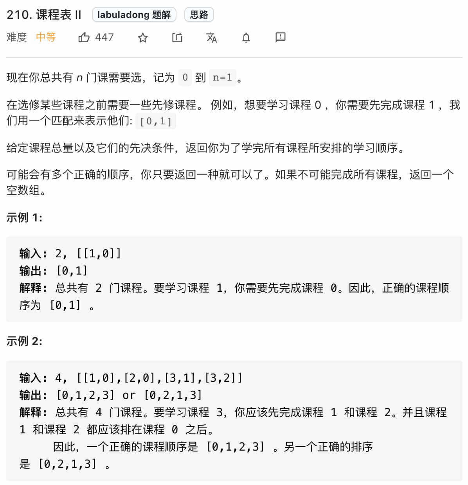
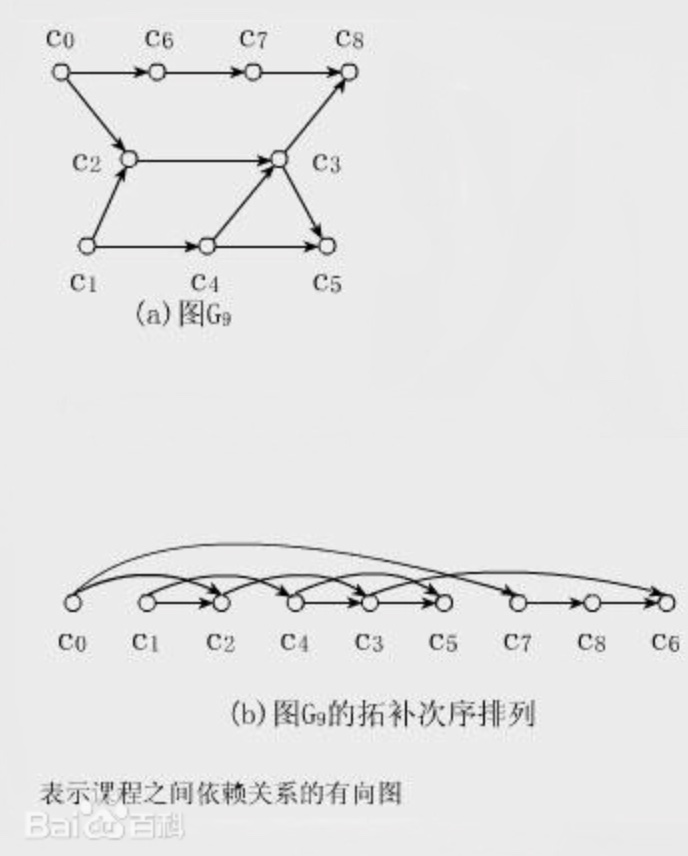
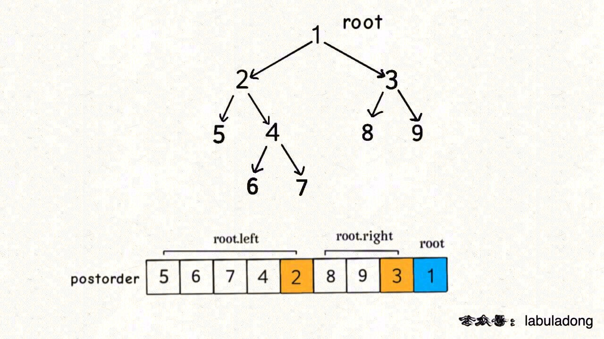
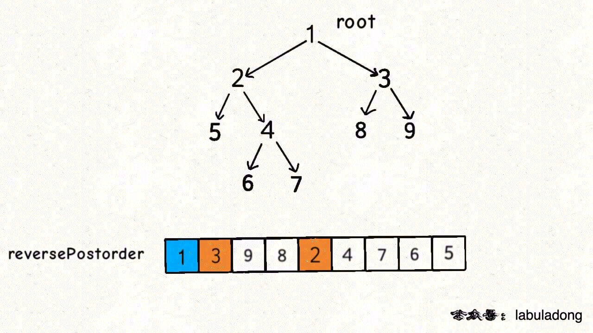

# 课程表II

[https://leetcode-cn.com/problems/course-schedule-ii/](https://leetcode-cn.com/problems/course-schedule-ii/)



这道题就是上道题的进阶版，不是仅仅让你判断是否可以完成所有课程，而是进一步让你返回一个合理的上课顺序，保证开始修每个课程时，前置的课程都已经修完。

这里我先说一下拓扑排序（Topological Sorting）这个名词，网上搜出来的定义很数学，这里干脆用百度百科的一幅图来让你直观地感受下：



直观地说就是，让你把一幅图「拉平」，而且这个「拉平」的图里面，所有箭头方向都是一致的，比如上图所有箭头都是朝右的。

很显然，如果一幅有向图中存在环，是无法进行拓扑排序的，因为肯定做不到所有箭头方向一致；反过来，如果一幅图是「有向无环图」，那么一定可以进行拓扑排序。

但是我们这道题和拓扑排序有什么关系呢？

其实也不难看出来，如果把课程抽象成节点，课程之间的依赖关系抽象成有向边，那么这幅图的拓扑排序结果就是上课顺序。

首先，我们先判断一下题目输入的课程依赖是否成环，成环的话是无法进行拓扑排序的，所以我们可以复用上一道题的主函数：

```
public int[] findOrder(int numCourses, int[][] prerequisites) {
    if (!canFinish(numCourses, prerequisites)) {
        // 不可能完成所有课程
        return new int[]{};
    }
    // ...
}
```

那么关键问题来了，如何进行拓扑排序？是不是又要秀什么高大上的技巧了？

其实特别简单，将后序遍历的结果进行反转，就是拓扑排序的结果。

PS：有的读者提到，他在网上看到的拓扑排序算法不用对后序遍历结果进行反转，这是为什么呢？

你确实可以看到这样的解法，原因是他建图的时候对边的定义和我不同。我建的图中箭头方向是「被依赖」关系，比如节点 1 指向 2，含义是节点 1 被节点 2 依赖，即做完 1 才能去做 2，

如果你反过来，把有向边定义为「依赖」关系，那么整幅图中边全部反转，就可以不对后序遍历结果反转。具体来说，就是把我的解法代码中 graph[from].add(to); 改成 graph[to].add(from); 就可以不反转了。

不过呢，现实中一般都是从初级任务指向进阶任务，所以像我这样把边定义为「被依赖」关系可能比较符合我们的认知习惯。

直接看解法代码吧，在上一题环检测的代码基础上添加了记录后序遍历结果的逻辑：

```
// 记录后序遍历结果
List<Integer> postorder = new ArrayList<>();
// 记录是否存在环
boolean hasCycle = false;
boolean[] visited, onPath;

// 主函数
public int[] findOrder(int numCourses, int[][] prerequisites) {
    List<Integer>[] graph = buildGraph(numCourses, prerequisites);
    visited = new boolean[numCourses];
    onPath = new boolean[numCourses];
    // 遍历图
    for (int i = 0; i < numCourses; i++) {
        traverse(graph, i);
    }
    // 有环图无法进行拓扑排序
    if (hasCycle) {
        return new int[]{};
    }
    // 逆后序遍历结果即为拓扑排序结果
    Collections.reverse(postorder);
    int[] res = new int[numCourses];
    for (int i = 0; i < numCourses; i++) {
        res[i] = postorder.get(i);
    }
    return res;
}

// 图遍历函数
void traverse(List<Integer>[] graph, int s) {
    if (onPath[s]) {
        // 发现环
        hasCycle = true;
    }
    if (visited[s] || hasCycle) {
        return;
    }
    // 前序遍历位置
    onPath[s] = true;
    visited[s] = true;
    for (int t : graph[s]) {
        traverse(graph, t);
    }
    // 后序遍历位置
    postorder.add(s);
    onPath[s] = false;
}

// 建图函数
List<Integer>[] buildGraph(int numCourses, int[][] prerequisites) {
    // 代码见前文
}
```

代码虽然看起来多，但是逻辑应该是很清楚的，只要图中无环，那么我们就调用 traverse 函数对图进行 DFS 遍历，记录后序遍历结果，最后把后序遍历结果反转，作为最终的答案。

**那么为什么后序遍历的反转结果就是拓扑排序呢？**

我这里也避免数学证明，用一个直观地例子来解释，我们就说二叉树，这是我们说过很多次的二叉树遍历框架：

```
void traverse(TreeNode root) {
    // 前序遍历代码位置
    traverse(root.left)
    // 中序遍历代码位置
    traverse(root.right)
    // 后序遍历代码位置
}
```

二叉树的后序遍历是什么时候？遍历完左右子树之后才会执行后序遍历位置的代码。换句话说，**当左右子树的节点都被装到结果列表里面了，根节点才会被装进去。**

**后序遍历的这一特点很重要，之所以拓扑排序的基础是后序遍历，是因为一个任务必须等到它依赖的所有任务都完成之后才能开始开始执行。**

你把二叉树理解成一幅有向图，边的方向是由父节点指向子节点，那么就是下图这样：



按照我们的定义，边的含义是「被依赖」关系，那么上图的拓扑排序应该首先是节点 1，然后是 2, 3，以此类推。

但显然标准的后序遍历结果不满足拓扑排序，而如果把后序遍历结果反转，就是拓扑排序结果了：



以上，我直观解释了一下为什么「拓扑排序的结果就是反转之后的后序遍历结果」，当然，我的解释并没有严格的数学证明，有兴趣的读者可以自己查一下。

