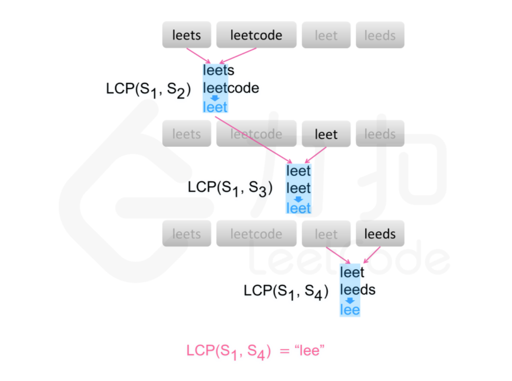

# 最长公共前缀

这是一个简单题，不要想的太复杂。

## 方法：横向扫描

用 LCP(S1,...,Sn)表示字符串 S1,...,Sn的最长公共前缀。

可以得到如下结论：

LCP(S1,...,Sn) = LCP(LCP(LCP(S1,S2), S3), Sn)

基于该结论，可以得到一种查找字符串数组中的最长公共前缀的简单方法。依次遍历字符串数组中的每个字符串，对于每个遍历到的字符串，更新最长公共前缀，当遍历完所有的字符串以后，即可得到字符串数组中的最长公共前缀。

如果在尚未遍历完所有的字符串时，最长公共前缀已经是空串，则最长公共前缀一定是空串，因此不需要继续遍历剩下的字符串，直接返回空串即可。