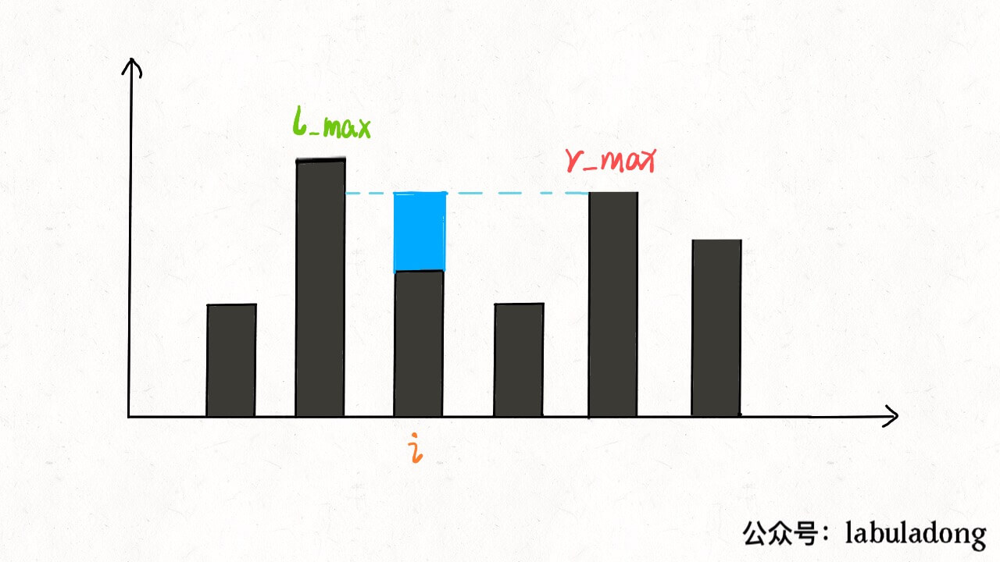
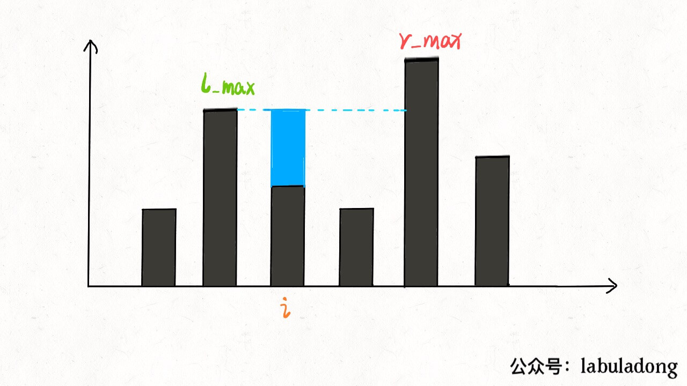
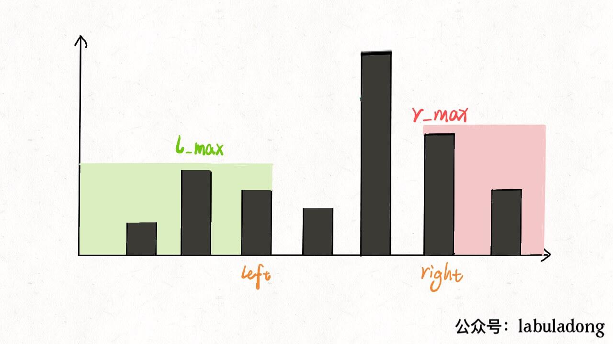
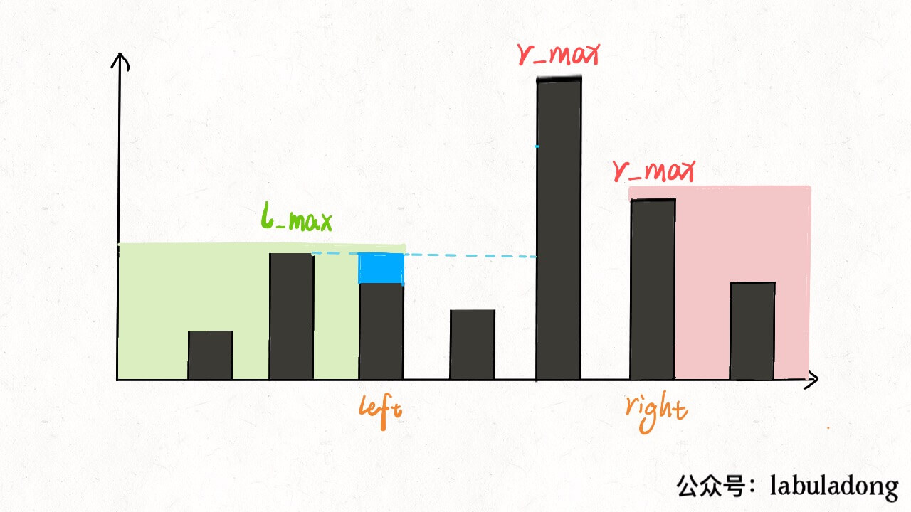

# 接雨水

## 核心思路

所以对于这种问题，我们不要想整体，而应该去想局部；就像之前的文章写的动态规划问题处理字符串问题，不要考虑如何处理整个字符串，而是去思考应该如何处理每一个字符。

这么一想，可以发现这道题的思路其实很简单。具体来说，仅仅对于位置 i，能装下多少水呢？


能装 2 格水。为什么位置 i 最多能盛 2 格水呢？因为，位置 i 能达到的水柱高度和其左边的最高柱子、右边的最高柱子有关，我们分别称这两个柱子高度为 l_max 和 r_max；位置 i 最大的水柱高度就是 min(l_max, r_max) - height[i]。





这就是本问题的核心思路。

## 双指针解法

双指针解法是本题的最优解法，时间复杂度O(N)，空间复杂度O(1)。用双指针边走边算，节省下空间复杂度。

直接看代码：

```
func trap(height []int) int {
	res := 0
	left := 0
	right := len(height) - 1
	lMax := 0
	rMax := 0
	for left < right {
		lMax = max(lMax, height[left])
		rMax = max(rMax, height[right])
		if lMax < rMax {
			res += lMax - height[left]
			left++
		} else {
			res += rMax - height[right]
			right--
		}
	}
	return res
}

func max(x, y int) int {
	if x > y {
		return x
	}
	return y
}
```

对于这部分代码，请问 lMax 和 rMax 分别表示什么意义呢？

很容易理解，lMax 是 height[0..left] 中最高柱子的高度，rMax 是 height[right..end] 的最高柱子的高度。

核心思想一样，但是还是有点细节差异。之前，lMax[i] 和 rMax[i] 分别代表 height[0..i] 和 height[i..end] 的最高柱子高度。

但是双指针解法中，lMax 和 rMax 代表的是 height[0..left] 和 height[right..end] 的最高柱子高度。

比如这段代码：

```
if (l_max < r_max) {
    res += l_max - height[left];
    left++; 
} 
```



此时的 l_max 是 left 指针左边的最高柱子，但是 r_max 并不一定是 left 指针右边最高的柱子，这真的可以得到正确答案吗？

其实这个问题要这么思考，我们只在乎 min(l_max, r_max)。对于上图的情况，我们已经知道 l_max < r_max 了，至于这个 r_max 是不是右边最大的，不重要。重要的是 height[i] 能够装的水只和较低的 l_max 之差有关。



这样，接雨水问题就解决了。


