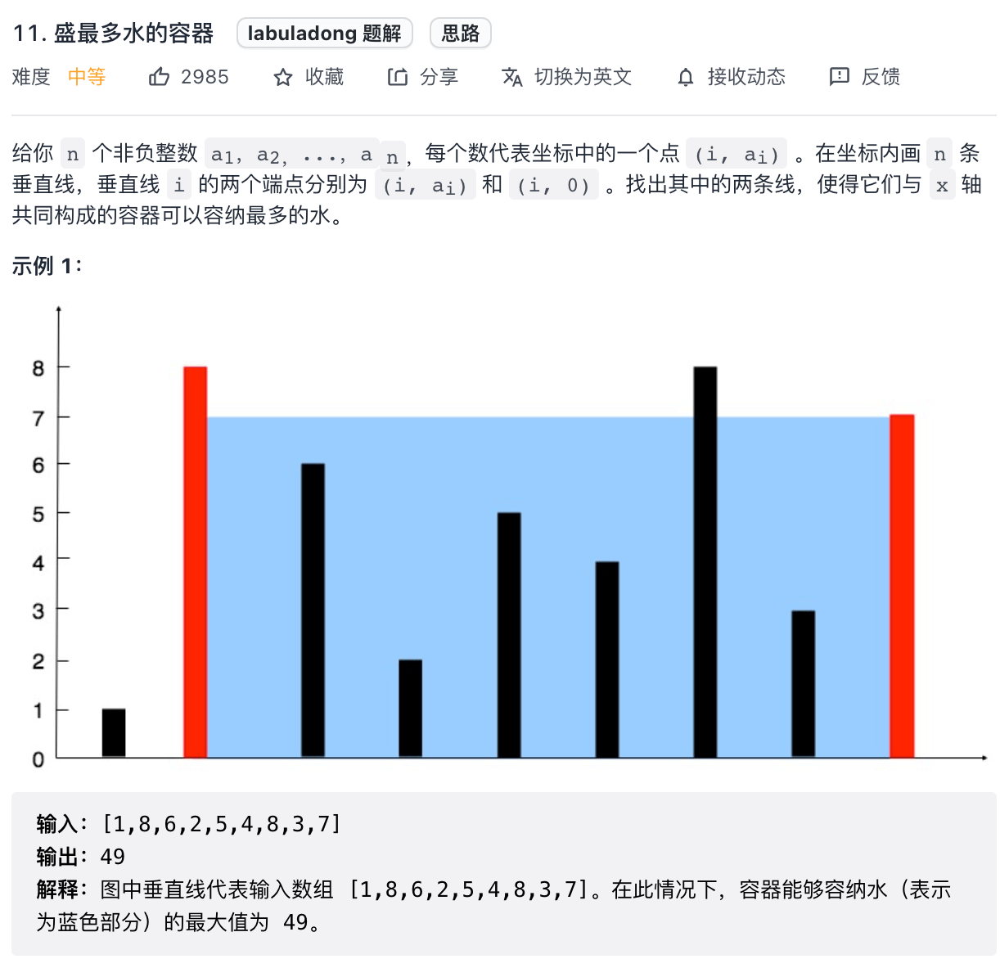

# 盛最多水的容器

下面我们看一道和接雨水问题非常类似的题目，力扣第 11 题「 盛最多水的容器」：



这题和接雨水问题很类似，可以完全套用前文的思路，而且还更简单。两道题的区别在于：

接雨水问题给出的类似一幅直方图，每个横坐标都有宽度，而本题给出的每个横坐标是一条竖线，没有宽度。

我们前文讨论了半天 l_max 和 r_max，实际上都是为了计算 height[i] 能够装多少水；而本题中 height[i] 没有了宽度，那自然就好办多了。

举个例子，如果在接雨水问题中，你知道了 height[left] 和 height[right] 的高度，你能算出 left 和 right 之间能够盛下多少水吗？

不能，因为你不知道 left 和 right 之间每个柱子具体能盛多少水，你得通过每个柱子的 l_max 和 r_max 来计算才行。

反过来，就本题而言，你知道了 height[left] 和 height[right] 的高度，能算出 left 和 right 之间能够盛下多少水吗？

可以，因为本题中竖线没有宽度，所以 left 和 right 之间能够盛的水就是：

```
min(height[left], height[right]) * (right - left)
```

类似接雨水问题，高度是由 height[left] 和 height[right] 较小的值决定的。

解决这道题的思路依然是双指针技巧：

用 left 和 right 两个指针从两端向中心收缩，一边收缩一边计算 [left, right] 之间的矩形面积，取最大的面积值即是答案。

关键是判断，什么时候该用left++，什么时候该用right--。

## 详细解法

设两指针 i , j ，指向的水槽板高度分别为 h[i] , h[j] ，此状态下水槽面积为 S(i, j)。由于可容纳水的高度由两板中的 短板 决定，因此可得如下 面积公式 ：

```
S(i,j)=min(h[i],h[j])×(j−i)
```

在每个状态下，无论长板或短板向中间收窄一格，都会导致水槽 底边宽度 -1 变短：

- 若向内 移动短板 ，水槽的短板 min(h[i], h[j]) 可能变大，因此下个水槽的面积 可能增大。
- 若向内 移动长板 ，水槽的短板 min(h[i], h[j]) 不变或变小，因此下个水槽的面积 一定变小。

因此，初始化双指针分列水槽左右两端，循环每轮将短板向内移动一格，并更新面积最大值，直到两指针相遇时跳出；即可获得最大面积。