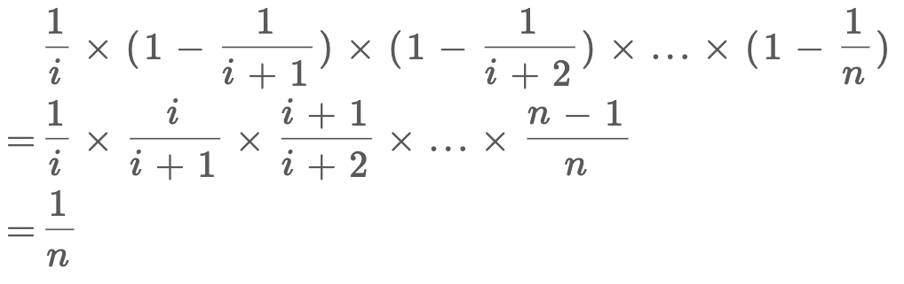

# 链表随机节点

本题其实是问：如何在无限序列中随机抽取元素。

## 解法

关于**水塘抽样**算法（Reservoir Sampling），本质上是一种随机概率算法，解法应该说会者不难，难者不会。

我第一次见到这个算法问题是谷歌的一道算法题：给你一个未知长度的链表，请你设计一个算法，只能遍历一次，随机地返回链表中的一个节点。

这里说的随机是均匀随机（uniform random），也就是说，如果有 n 个元素，每个元素被选中的概率都是 1/n，不可以有统计意义上的偏差。

一般的想法就是，我先遍历一遍链表，得到链表的总长度 n，再生成一个 [1,n] 之间的随机数为索引，然后找到索引对应的节点，不就是一个随机的节点了吗？

但题目说了，只能遍历一次，意味着这种思路不可行。

## 算法实现

这个问题的难点在于，随机选择是「动态」的，比如说你现在你有 5 个元素，你已经随机选取了其中的某个元素 a 作为结果，但是现在再给你一个新元素 b，你应该留着 a 还是将 b 作为结果呢？以什么逻辑做出的选择，才能保证你的选择方法在概率上是公平的呢？

先说结论，当你遇到第 i 个元素时，应该有 1/i 的概率选择该元素，1 - 1/i 的概率保持原有的选择。看代码容易理解这个思路：

```
func GetRandom(head *ListNode) int {
	p := head
	i := 0
	res := 0
	// 循环遍历链表
	for p != nil {
		i++
		// [0, i) 区间内随机选择一个整数。[0, i) 区间内的整数数量是i
		randNum := rand.Intn(i)
		// 在 [0, i) 中随机抽样，等于0的概率是 1/i
		// 1/i 的概率选择新来的值
		if randNum == 0 {
			res = p.Val
		}
		// 1 - 1/i 的概率，保持原值不变
		p = p.Next
	}
	return res
}
```

对于概率算法，代码往往都是很浅显的，但是这种问题的关键在于证明，你的算法为什么是对的？为什么每次以 1/i 的概率更新结果就可以保证结果是平均随机（uniform random）？

## 证明

假设总共有 n 个元素，我们要的随机性无非就是每个元素被选择的概率都是 1/n 对吧，那么对于第 i 个元素，它被选择的概率就是：



第 i 个元素被选择的概率是 1/i，第 i+1 次不被替换的概率是 1 - 1/(i+1)，以此类推，相乘就是第 i 个元素最终被选中的概率，就是 1/n。

因此，该算法的逻辑是正确的。

## 时间复杂度

以上的抽样算法时间复杂度是 O(n)，但不是最优的方法。更优化的算法基于几何分布，由于涉及的数学知识比较多，这里就不列出了，有兴趣的读者可以自行搜索一下。