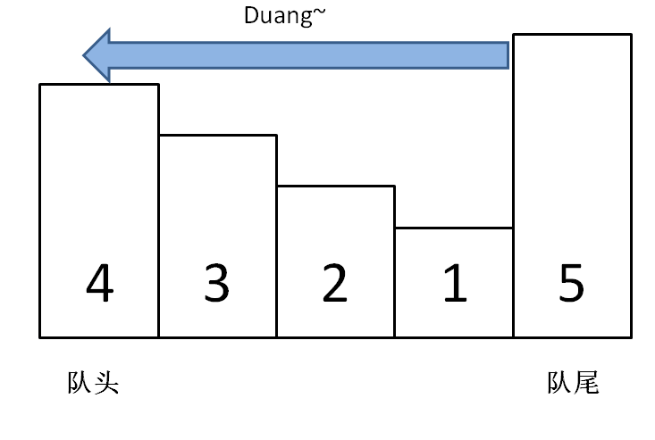

# 单调队列解法

使用一个队列充当不断滑动的窗口，每次滑动记录其中的最大值。


## 单调队列

单调队列就是一个队列，只不过队列中的元素全都是单调递增（或递减）的。go语言里就用 []int 类型实现。

## 搭建解题框架

在介绍「单调队列」这种数据结构的 API 之前，先来看看一个普通的队列的标准 API：

```
class Queue {
    // enqueue 操作，在队尾加入元素 n
    void push(int n);
    // dequeue 操作，删除队头元素
    void pop();
}
```

我们要实现的「单调队列」的 API 也差不多：

```
class MonotonicQueue {
    // 在队尾添加元素 n
    void push(int n);
    // 返回当前队列中的最大值
    int max();
    // 队头元素如果是 n，删除它
    void pop(int n);
}
```

当然，这几个 API 的实现方法肯定跟一般的 Queue 不一样，不过我们暂且不管，而且认为这几个操作的时间复杂度都是 O(1)，先把这道「滑动窗口」问题的解答框架搭出来：

```
func maxSlidingWindow(nums []int, k int) []int {
	res := make([]int, 0)
	n := len(nums)
	mq := newMonotonicQueue()
	// 先将前k个元素放入队列
	for i := 0; i < k; i++ {
		mq.push(nums[i])
	}
	// 记录前k个元素的最大值  
	res = append(res, mq.max())
	for i := k; i < n; i++ {
	    // 滑动窗口移除最前面的元素
		mq.pop(nums[i-k])
		// 滑动窗口添加最后面的元素
		mq.push(nums[i])
		// 记录最大值
		maxVal := mq.max()
		res = append(res, maxVal)
	}
	return res
}
```

## 实现单调队列数据结构

如何在 O(1) 时间计算最大值，只需要一个特殊的数据结构「单调队列」，push 方法依然在队尾添加元素，但是要把前面比自己小的元素都删掉，直到遇到更大的元素才停止删除。



## 时间复杂度

时间复杂度：O(n)，其中 n 是数组 nums 的长度。每一个下标恰好被放入队列一次，并且最多被弹出队列一次，因此时间复杂度为 O(n)。


