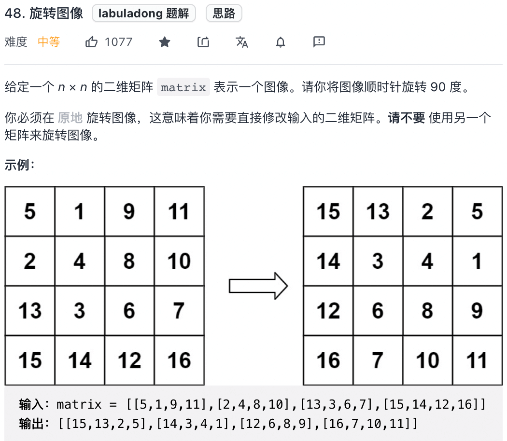
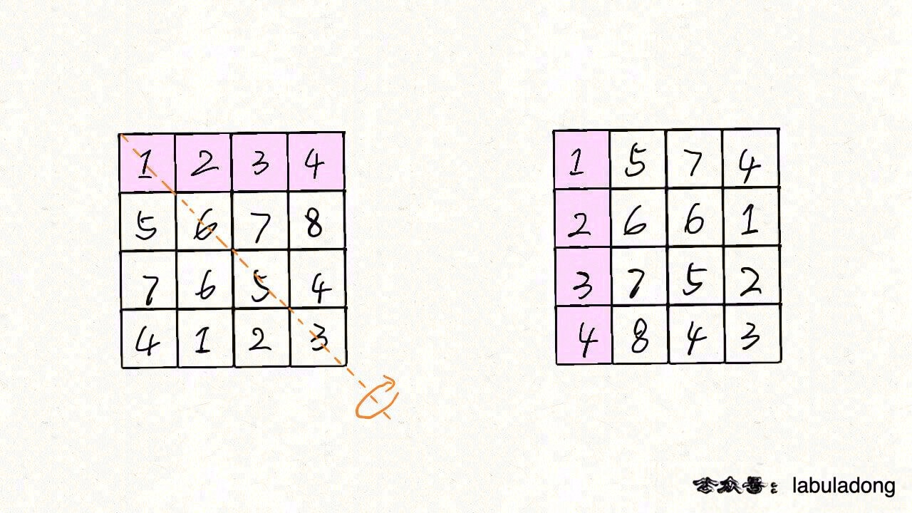
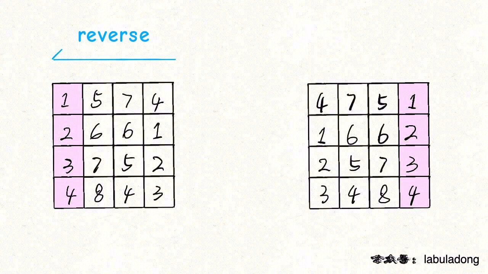
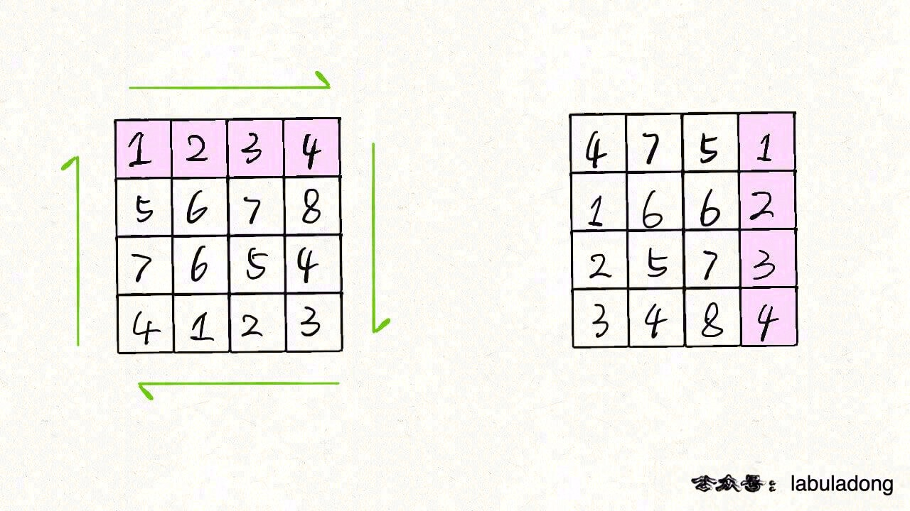

# 旋转图像

对二维数组进行旋转是常见的笔试题，力扣第 48 题「 旋转图像」就是很经典的一道：



题目很好理解，就是让你将一个二维矩阵顺时针旋转 90 度，难点在于要「原地」修改。

如何「原地」旋转二维矩阵？稍想一下，感觉操作起来非常复杂，可能要设置巧妙的算法机制来「一圈一圈」旋转矩阵。

但实际上，这道题不能走寻常路。

回到之前说的顺时针旋转二维矩阵的问题，常规的思路就是去寻找原始坐标和旋转后坐标的映射规律，但我们是否可以让思维跳跃跳跃，尝试把矩阵进行反转、镜像对称等操作，可能会出现新的突破口。

## 解法

- 矩阵先按照左上到右下的对角线进行镜像对称，再每行反转，就是答案。

我们可以先将 n x n 矩阵 matrix 按照左上到右下的对角线进行镜像对称：



然后再对矩阵的每一行进行反转：



发现结果就是 matrix 顺时针旋转 90 度的结果:



将上述思路翻译成代码，即可解决本题：

```
func rotate(matrix [][]int) {
	n := len(matrix)
	for i := 0; i < n; i++ {
		for j := i + 1; j < n; j++ {
			matrix[i][j], matrix[j][i] = matrix[j][i], matrix[i][j]
		}
	}
	for i := 0; i < n; i++ {
		reverseRow(matrix, n, i)
	}
}

func reverseRow(matrix [][]int, n int, row int) {
	p := 0
	q := n - 1
	for p < q {
		matrix[row][p], matrix[row][q] = matrix[row][q], matrix[row][p]
		p++
		q--
	}
}
```

肯定有读者会问，如果没有做过这道题，怎么可能想到这种思路呢？

仔细想想，旋转二维矩阵的难点在于将「行」变成「列」，将「列」变成「行」，而只有按照对角线的对称操作是可以轻松完成这一点的，对称操作之后就很容易发现规律了。