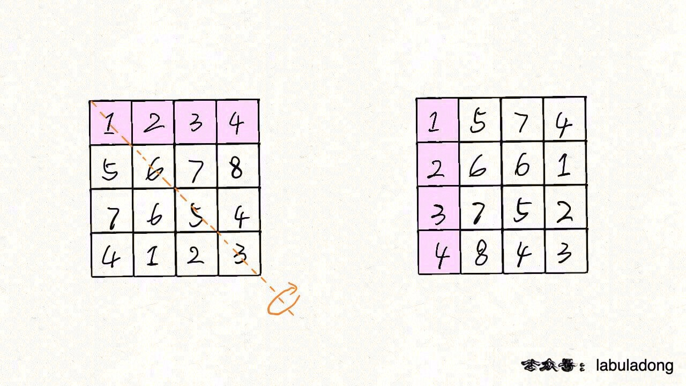
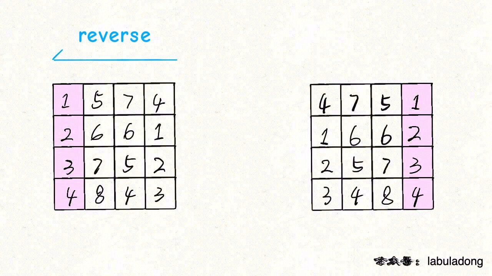
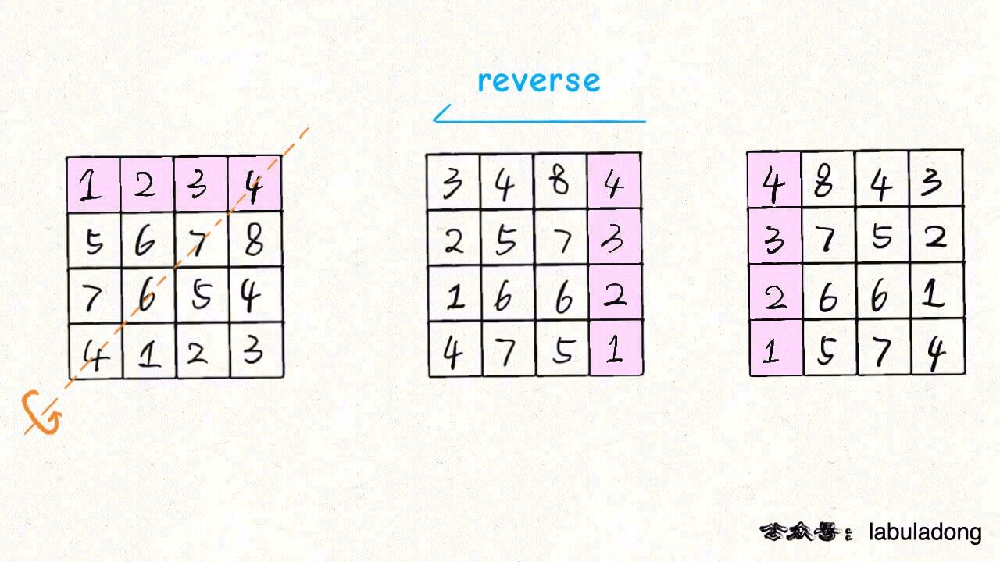

# 矩阵的花式遍历技巧

## 矩阵顺时针旋转90度

1. 矩阵 matrix 按照左上到右下的对角线进行镜像对称：



2. 然后再对矩阵的每一行进行反转：



## 矩阵逆时针旋转90度

思路是类似的，只要通过另一条对角线镜像对称矩阵，然后再反转每一行，就得到了逆时针旋转矩阵的结果：



代码如下：

```
func rotate(matrix [][]int) {
	n := len(matrix)
	for i := 0; i < n; i++ {
		for j := 0; j < n - i; j++ {
			matrix[i][j], matrix[n - j - 1][n - i - 1] = matrix[n - j - 1][n - i - 1], matrix[i][j]
		}
	}
	for i := 0; i < n; i++ {
		reverseRow(matrix, n, i)
	}
}

func reverseRow(matrix [][]int, n int, row int) {
	p := 0
	q := n - 1
	for p < q {
		matrix[row][p], matrix[row][q] = matrix[row][q], matrix[row][p]
		p++
		q--
	}
}
```